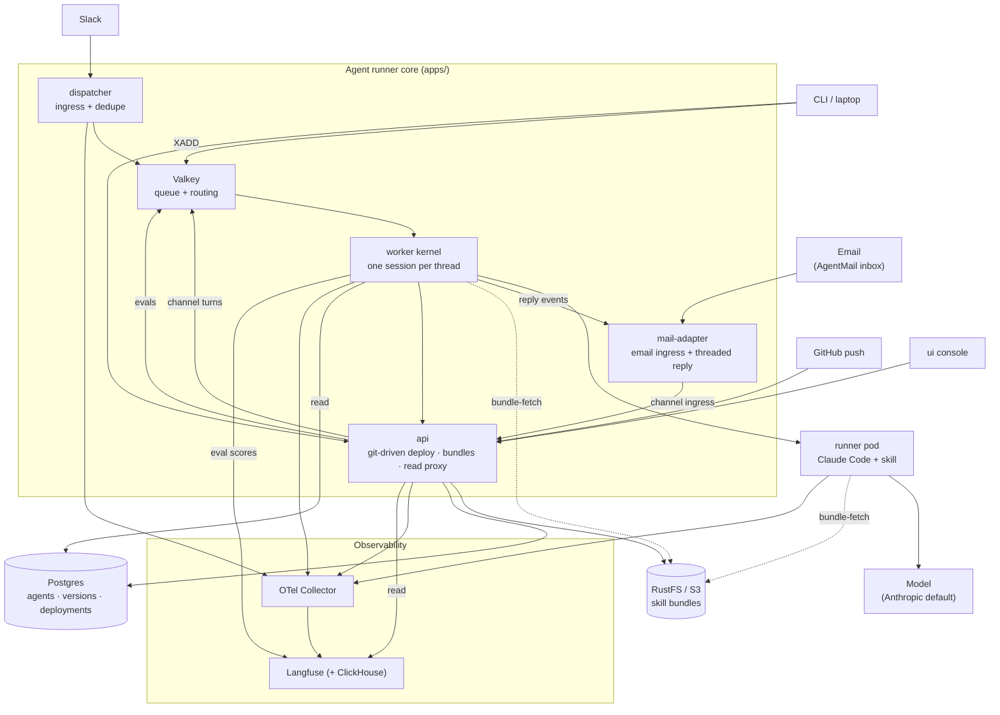
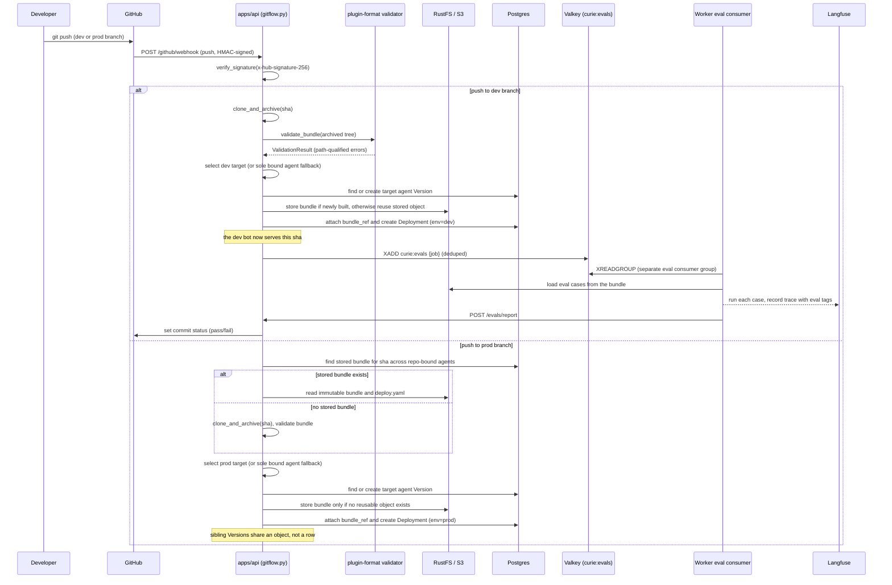
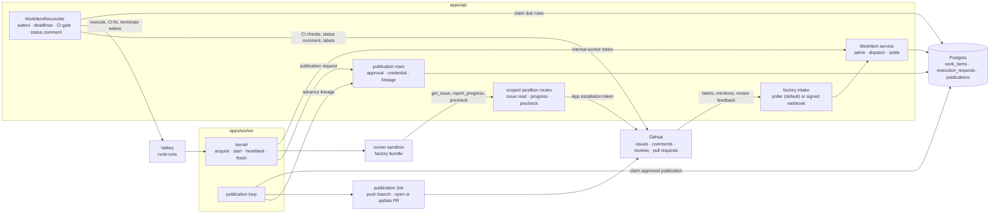
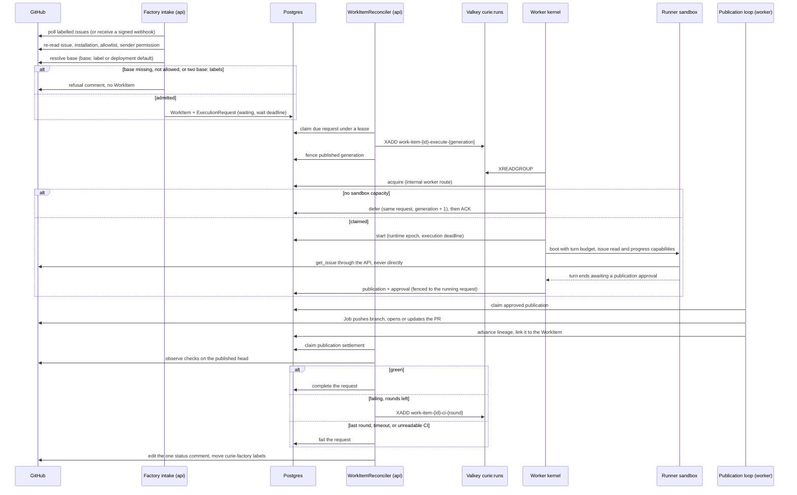

# Curie Architecture (as built)

Curie (codename **Relay**) turns a Slack thread into a conversation with a
versioned, sandboxed AI agent, and turns a git push into a deployment of that
agent. Slack, Discord, and email are the three wired channels today; all sit behind a
channel-agnostic message port ([ADR 0020](docs/adr/0020-message-port-rendering-free-channel-interface.md)),
so additional channels are additive, not a rewrite. This document is the as-built map. It covers:

- the components
- the two runtime modes and what is identical between them
- how one Slack turn and one eval run flow through the system
- how model credentials reach the model
- how traces come back out

Every claim carries a repo path you can jump to. Paths are relative to the repo
root. Where main does not yet contain something the design calls for, it is
marked **not yet in main** rather than described as shipped. Those items are
tracked in [GitHub issues](https://github.com/curie-eng/curie/issues).

The narrative "why" behind the big calls lives in the ADRs (Architecture
Decision Records) ([`docs/adr/`](docs/adr/)). This doc is the "what talks to
what." It supersedes the pre-build plans that the MVP (Minimum Viable Product)
was built from, which are preserved in git history.

For a navigable version of this map, open the
[interactive architecture atlas](https://htmlpreview.github.io/?https://github.com/curie-eng/curie/blob/main/docs/architecture-atlas/index.html).
It overlays current and planned flows, maturity-rated seams, ADRs, implementation
detail, and documentation drift on one version-selectable system diagram.

## Table of contents

- [Clause status](#clause-status)
  - [Local to production parity](#local-to-production-parity)
  - [Git flow deploy](#git-flow-deploy)
  - [Eval gate](#eval-gate)
- [Overview](#overview)
- [Component map](#component-map)
  - [Adopted, not built](#adopted-not-built)
- [Handling a Slack mention (message flow)](#handling-a-slack-mention-message-flow)
  - [The four kernel invariants](#the-four-kernel-invariants)
  - [Handling approvals (human in the loop)](#handling-approvals-human-in-the-loop)
  - [Deliberate progress (ADR 0130)](#deliberate-progress-adr-0130)
- [The action ledger and the connector action executor](#the-action-ledger-and-the-connector-action-executor)
- [Pushing agent versions with git (deploy flow)](#pushing-agent-versions-with-git-deploy-flow)
- [Factory work items and publication](#factory-work-items-and-publication)
  - [Factory component map](#factory-component-map)
  - [One factory run, end to end](#one-factory-run-end-to-end)
  - [Factory clause status](#factory-clause-status)
- [One worker, two hidden seams: substrate and transport](#one-worker-two-hidden-seams-substrate-and-transport)
  - [Substrate seam — `SandboxClient`](#substrate-seam--sandboxclient)
  - [Slack seam — a per-turn reply endpoint and the CLI stub](#slack-seam--a-per-turn-reply-endpoint-and-the-cli-stub)
- [The credential path](#the-credential-path)
- [The observability pipeline](#the-observability-pipeline)
- [The UI: always the real API, no demo mode](#the-ui-always-the-real-api-no-demo-mode)
- [Frozen contracts](#frozen-contracts)
- [Deployment, CI, and release](#deployment-ci-and-release)
- [What is built vs deferred](#what-is-built-vs-deferred)

## Clause status

The tables below state what the code enforces for the three load bearing
claims in this map. They are a documentation pattern borrowed from
[YC QM's MIT licensed deploy directory](https://github.com/yc-software/qm/blob/main/docs/deploy-directory.md).

`ENFORCED` means product code rejects a violating state, or a required gate
executes the real consumer and rejects it. `VALIDATED-ONLY` means a checker or
scheduled run observes the clause, but ordinary operation can diverge or the
failure is not fatal. `RESERVED` means the intended slot exists without active
enforcement. This evidence snapshot is `origin/next` commit `1465cb25`, read
on 2026-08-20.

### Local to production parity

| Clause | Status | Evidence and limit |
| --- | --- | --- |
| Skill uses an immutable snapshot | ENFORCED | `cli/src/bundle.rs`, `cli/src/commands/skill.rs`, and `cli/src/docker.rs` materialize and mount a content addressed snapshot read only. The snapshot materialization test in `cli/src/bundle.rs` and `cli/scripts/e2e.sh` AC1 mutate the source after boot and require unchanged mounted bytes and digest. |
| Every tier uses the same bundle | VALIDATED-ONLY | `cli/scripts/e2e-ladder.sh` compares independently computed skill, local, local release, and cluster receipt digests in `assert_bundle_identity`. Individual commands do not require a prior rung digest and can deploy different trees. |
| Every tier uses the same eval suite | VALIDATED-ONLY | `cli/scripts/e2e-ladder.sh` asserts suite name and count only from each tier's `eval --dry-run` in `assert_suite`. The bundle digest covers the suite bytes, but this dry run check does not read or compare case ids. No product state binds later tier commands to an earlier suite. |
| Every tier uses the same model mode | VALIDATED-ONLY | `cli/scripts/e2e-ladder.sh` checks deployed `CURIE_FAKE_MODEL` in `assert_model_mode`, `probe_local_fake_model`, and `probe_cluster_fake_model`. Mode remains independently configurable outside the ladder. |
| Local runtime binds the newly deployed version | VALIDATED-ONLY | `cli/scripts/e2e-ladder.sh` proves this during a local run in `assert_sole_active_deployment`. The database and worker allow several active deployments and normally resolve prod first. |
| Cluster runtime binds the newly deployed version | VALIDATED-ONLY | The `rung_cluster` path in `cli/scripts/e2e-ladder.sh` runs `assert_sole_active_deployment` only with `CURIE_API_KEY`. The CI and nightly cluster jobs lack that key and report upload identity proved but runtime binding unproved. |
| Pull request parity ladder exercises all fake tiers | ENFORCED | `.github/workflows/ci.yaml` jobs `e2e-ladder`, `e2e-ladder-release`, and `e2e-ladder-cluster` drive skill, Compose, generated release Compose, and kind. `e2e-required` rejects a selected job result other than success. |
| Nightly live ladder exercises live tiers | VALIDATED-ONLY | `.github/workflows/nightly-graded-ladder.yaml` jobs `ladder-skill-local`, `ladder-local-release`, and `ladder-cluster` run with `CURIE_E2E_LIVE=1`. GitHub Actions history from runs `30991073908` through `32231275073` has 10 successes of 20: 6 successes from 15 scheduled runs and 4 successes from 5 manual dispatches. It is a scheduled observation, not a merge gate. `release/authorize.py` refuses a `v*` tag when the latest completed nightly on the tagged commit's base branch is not `success`, unless a merged PR body records `--allow-red-nightly` (#2245). |

### Git flow deploy

The routing and bundle-reuse rows below were refreshed against `main` commit
`8a100864b` on 2026-09-30.

| Clause | Status | Evidence and limit |
| --- | --- | --- |
| Webhook push ingress verifies HMAC | ENFORCED | `apps/api/src/curie_api/routers/github.py::github_webhook` rejects before dispatch unless `gitflow.verify_signature` accepts the raw body and `X-Hub-Signature-256`. `apps/api/tests/test_gitflow_integration.py::test_invalid_signature_is_401` covers the route. `apps/api/src/curie_api/commitpoller.py::CommitPoller` is a separate outbound GitHub API ingress without HMAC. |
| Webhook and commit poller ingress converge on one push flow | ENFORCED | `apps/api/src/curie_api/routers/github.py` and `apps/api/src/curie_api/commitpoller.py` both hand a push payload to `apps/api/src/curie_api/gitflow.py::process_push`. `apps/api/tests/test_commitpoller.py::test_the_payload_is_shaped_like_a_real_webhook` pins the poller payload shape used by that flow. |
| Only configured deploy branch refs deploy | ENFORCED | `apps/api/src/curie_api/gitflow.py::environment_for_ref` accepts only exact configured `refs/heads/` values. `test_environment_for_ref_requires_exact_head_ref` and `test_non_deploy_branch_is_ignored` reject tags and other branches. |
| A newly fetched bundle archives the pushed SHA | ENFORCED | `apps/api/src/curie_api/gitflow.py::process_push` validates the SHA format and clone origin on both paths. Dev always calls `clone_and_archive`; prod skips the remote when a stored bundle for that SHA exists in the bound repository. `test_clone_and_archive_rejects_invalid_sha_before_any_subprocess`, `test_clone_hands_git_the_derived_origin_not_the_payload_url`, and `test_dev_push_deploys_dev_bot` pin the archive path. |
| A pushed bundle is validated | ENFORCED | `gitflow.process_push` calls `deploy.validate_archive`, `bundles.extract_and_validate`, and `plugin_format.validate_bundle`. `apps/api/tests/test_gitflow_integration.py::test_malformed_bundle_push_is_rejected` proves an invalid archive cannot become a deployment. |
| A dev push stores a version and dev deployment | ENFORCED | `gitflow.process_push` calls `crud.versions.create_version_row`, `deploy.store_bundle`, and `crud.deployments.create_deployment_row`. `apps/api/tests/test_gitflow_integration.py::test_dev_push_deploys_dev_bot` proves the bundle, version, and deployment in Postgres and RustFS. |
| Version bundles are write once | VALIDATED-ONLY | `apps/api/src/curie_api/routers/bundles.py::upload_bundle` rejects sequential replacement with 409, and `apps/api/tests/test_bundles.py::test_bundles_are_immutable` pins that behavior. `apps/api/src/curie_api/crud/versions.py::attach_bundle` has no compare and swap, so concurrent uploads are not an enforced immutability invariant. |
| A new dev bundle fans out one eval job | ENFORCED | `gitflow.process_push` enqueues only for a newly built dev bundle. `apps/api/tests/test_evalqueue_integration.py::test_dev_push_fans_out_prod_push_does_not` proves the Valkey stream write, and `test_redelivered_dev_push_does_not_refan_out` proves deduplication. |
| A graded eval posts its commit status | VALIDATED-ONLY | `apps/api/src/curie_api/routers/evals.py::report_eval` maps a report through `GitHubStatusReporter.report_eval`, and `apps/api/tests/test_github_checks.py::test_report_eval_posts_the_exact_commit_status` pins that payload. It needs a GitHub token, and `apps/worker/src/curie_worker/eval/stream.py` treats worker reporting failure as nonfatal. |
| A red eval blocks prod promotion | RESERVED | `apps/api/src/curie_api/gitflow.py::process_push` does not read an eval result or commit status before creating a prod deployment. Curie does not configure or verify external repository branch protection. |
| A prod deployment reuses an existing stored bundle | ENFORCED | `gitflow.get_version_by_commit` and `_sibling_bundle` reuse stored artifacts when present. Each target agent owns its own Version row; sibling rows share `bundle_ref` and commit SHA. `test_main_push_promotes_and_reuses_the_built_version` and `test_prod_promotes_the_exact_artifact_dev_validated` cover same-agent and sibling-agent reuse. |
| A prod push requires a prebuilt dev artifact | RESERVED | `gitflow.process_push` looks for a stored bundle before cloning on prod. If none exists, it archives and validates, then creates or repairs a bundle. `test_partial_version_is_rebuilt_not_reused` confirms this repair path, so a prod first push can build and deploy. |
| Webhook and manual deployments share persistence | ENFORCED | Webhooks use `crud.versions.create_version_row` and `crud.deployments.create_deployment_row`; `apps/api/src/curie_api/routers/agents.py` and `apps/api/src/curie_api/routers/deployments.py` use the same CRUD rows. |
| Listed clients use the same bundle validator | ENFORCED | The webhook calls `deploy.validate_archive`; `apps/ui/src/views/wired/WiredAgentDetail.tsx` calls `createVersion`, `uploadBundle`, and `createDeployment`; the upload route uses that validator. `cli/src/api.rs` follows the sequence, pinned by the deploy contract test in `cli/tests/api_deploy.rs`. |
| The server enforces one deployment pipeline | VALIDATED-ONLY | Listed clients follow the intended sequence, but `schemas.versions.VersionCreate` accepts `bundle_ref` and `apps/api/src/curie_api/routers/deployments.py` permits a deployment with no bundle because `revalidate_stored_bundle` returns when `bundle_ref` is absent. Client behavior is validated, not a server invariant. |

### Eval gate

| Clause | Status | Evidence and limit |
| --- | --- | --- |
| Eval cases have one checked schema | ENFORCED | Pydantic owns `apps/worker/schema/eval-cases.schema.json`; `apps/worker/tests/eval/test_schema_compat.py` rejects generated artifact drift; the schema grader deserialization test in `cli/src/evals.rs` rejects a grader kind the Rust loader cannot read. |
| Text graders determine pass or fail | ENFORCED | `cli/src/evals.rs` serves skill eval through `Grader::grade`; `cli/src/message.rs` serves local and cluster messages through `reply_passes`. `cli/src/commands/eval.rs` exits failure for any genuine case failure, with unit coverage for exact, contains, regex, terminal status, and classified failures. |
| Trajectory grader semantics agree across languages | ENFORCED | Python `apps/worker/src/curie_worker/eval/scorer.py::match_trajectory` and Rust `cli/src/evals.rs` replay `tests/vectors/trajectory-match.json`. `apps/worker/tests/eval/test_trajectory.py::test_python_matcher_owns_the_shared_cross_language_vectors` and the five mode trajectory test in `cli/tests/trajectory_eval.rs` cover all modes. |
| One server side grader implementation exists | RESERVED | `cli/src/evals.rs` and `apps/worker/src/curie_worker/eval/models.py` each implement graders. Shared schema and vectors limit drift but do not create one implementation. |
| Fake models cannot produce a quality pass | ENFORCED | `cli/src/evals.rs` and `apps/worker/src/curie_worker/eval/runner.py` return `PLUMBING_OK` before grading with a fake model. `apps/worker/src/curie_worker/eval/stream.py`, `cli/tests/fake_tier_plumbing.rs`, and worker tests pin the tri state. |
| Skill, local, and local release grade failures are fatal | ENFORCED | `cli/src/commands/eval.rs` exits 1 for a failed case. `cli/scripts/e2e-ladder.sh` runs skill, local, and local release evals under `set -e`; the associated nightly jobs therefore fail on those grades. |
| Cluster answer quality failure is fatal | VALIDATED-ONLY | The `rung_cluster` path in `cli/scripts/e2e-ladder.sh` runs live `cluster eval --json` but captures a failure and reports it without failing the rung, citing issue #1603. The current grader cannot prove forecast provenance. Cluster plumbing remains fatal, answer quality does not. |
| Cluster workers receive eval reporting environment | ENFORCED | On `next`, `charts/curie/templates/worker.yaml` supplies `CURIE_API_URL`, `CURIE_API_KEY`, and three `LANGFUSE_*` values. `charts/curie/ci/worker-eval-wiring-assertions.sh`, run as `helm render assertions (worker eval wiring)` in `.github/workflows/helm-ci.yaml`, requires one correctly sourced entry with default and connector enabled renders. Issue #1452 and PR #1486 fixed only these five worker reporting environment entries on `next`, not the broader installed cluster gate. |
| A semantic provenance grader exists | RESERVED | Neither Python nor Rust defines `GraderKind.verifier`. Issue #1603 names it as the prerequisite for a meaningful fatal cluster weather grade; the current exact, contains, regex, and `tool_called` kinds cannot prove source provenance. |
| A worker consumes, records, and reports an eval | VALIDATED-ONLY | `apps/worker/src/curie_worker/run.py` always supervises `EvalStreamConsumer`. `apps/worker/tests/eval/test_stream.py::test_seam_full_consume_eval_report_cycle` drives Valkey, RustFS bundle load, runner grade, Langfuse record, API report, and acknowledgement, but uses `MockTransport` for the API report hop. It validates the sequence, not the real report route. |
| GitHub status reporting is unconditional | VALIDATED-ONLY | `apps/api/src/curie_api/github_checks.py` posts only with a configured GitHub token; otherwise it logs and returns the computed state. `apps/api/tests/test_github_checks.py` covers both paths. |

Dev eval fanout and red eval promotion each appear once in
[Git flow deploy](#git-flow-deploy). They describe that deploy flow, rather
than separate eval transport claims.

## Overview

What Curie does, in short:

- Connect Slack.
- Author a Claude-Code-format plugin (skills + tools + MCP) in the browser or a repo.
- Deploy it as a bot identity.
- Get traces, evals, budgets, and git-driven deploys for free.

The core loop: a Slack mention is queued, picked up by a worker that claims a
sandboxed runner, and the runner's reply is edited back into the Slack thread.
The same worker code runs unchanged against Kubernetes in production or Docker
locally, and the CLI can stand in for Slack entirely for local testing — see
[Handling a Slack mention](#handling-a-slack-mention-message-flow) for the full
flow and [One worker, two hidden seams](#one-worker-two-hidden-seams-substrate-and-transport)
for how that substrate-agnosticism is built.

## Component map

This is the static "who talks to whom." For the flows through it, read the
focused diagram docs, each a single clean picture:

- **[How a message comes in and a reply goes out](docs/diagrams/message-flow.md)** — the core loop.
- **[Kubernetes architecture](docs/diagrams/kubernetes.md)** — the cluster and how a sandbox pod is built.
- **[The ACI](docs/diagrams/aci.md)** — the ACI, short for Agent Container Interface: the frozen contract between the worker and the agent in the box.
- **[Factory work items and publication](#factory-work-items-and-publication)**: how a labelled GitHub issue becomes a pull request.



The reply travels back out the way it came in — sandbox to worker to the
originating thread — kept off the diagram to avoid a tangle of return arrows.
[The message-flow doc](docs/diagrams/message-flow.md) shows that round trip.
Two substrate implementations sit behind the single `runner pod` box
(Kubernetes for production, Docker for local). [One worker, two hidden seams](#one-worker-two-hidden-seams-substrate-and-transport) covers that seam.

The worker is not a pass-through between the queue and the sandbox. It is a hub
with four outbound dependencies of its own:

- It reads the deployment binding from Postgres
  ([`apps/worker/src/curie_worker/run.py::build`](apps/worker/src/curie_worker/run.py)
  opens the engine on the same `DATABASE_URL` the API uses).
- It fetches a version's immutable bundle from the object store for eval runs
  ([`apps/worker/src/curie_worker/eval/stream.py::EvalStreamConsumer`](apps/worker/src/curie_worker/eval/stream.py)).
- It calls the API for approvals and `POST /evals/report`
  ([`apps/worker/src/curie_worker/approvals.py::ApprovalClient`](apps/worker/src/curie_worker/approvals.py),
  [`apps/worker/src/curie_worker/eval/stream.py::EvalReporter`](apps/worker/src/curie_worker/eval/stream.py)).
- It writes eval scores straight to Langfuse
  ([`apps/worker/src/curie_worker/eval/recorder.py::LangfuseEvalRecorder`](apps/worker/src/curie_worker/eval/recorder.py)).

The API, dispatcher, worker, and runner share the platform telemetry bootstrap:
they emit OTLP traces, correlated OTLP logs, and bounded operational metrics to
the collector. For local verification, the CLI runs the dispatcher's bounded,
Slack-free one-shot producer in the existing Compose network so the synthetic
turn crosses the real producer span and W3C carrier seam. The cluster driver
retains a direct carrierless enqueue as the legacy/missing-context control. See
[the Slack seam](#slack-seam--a-per-turn-reply-endpoint-and-the-cli-stub).

### Adopted, not built

Curie leans on these systems rather than building its own (ADR-0007,
[`docs/adr/0007-adopt-not-build-boundaries.md`](docs/adr/0007-adopt-not-build-boundaries.md)):

- Langfuse (traces + evals)
- Kubernetes Agent Sandbox (interactive runtime)
- Slack Bolt (Socket Mode)
- AgentMail (the email inbox, and the SPF/DKIM/DMARC filtering in front of it; see [`docs/operations.md`](docs/operations.md))
- Valkey Streams (queue)
- Postgres (app state)
- the OTel Collector
- **claude-agent-sdk** as the harness (ADR-0005) — one of the two most load-bearing adopt calls of all
- **the Claude Code plugin format verbatim** — the other, which ADR-0007 calls "the distribution wedge — do not invent a format"

AgentMail's filtering does not establish sender authentication that Curie can
verify. It supplies no trusted positive aligned verdict or guarantee of header
provenance and stripping. The mail adapter therefore refuses every current
AgentMail inbound message with `authentication_unverifiable` before starting a
turn or resolving an approval. Replies for historical accepted deliveries remain
deliverable. See [inbound security](apps/mail-adapter/README.md#inbound-security).

ADR-0007's Decision names **six** things Curie builds around that spine: the
web UI, the API server, the Slack dispatcher, the worker+runner glue, the CLI,
and the umbrella Helm chart ([Deployment, CI, and release](#deployment-ci-and-release)).
Its title says five, but an Accepted ADR's title is frozen (ADR-0045). Later
work added the [mail adapter](apps/mail-adapter), the
[Discord adapter](adapters/discord), and the factory's
[end to end connector](apps/e2e-connector). The
chart is a built thing, not a packaging afterthought. The security rails are
chart defaults, so the chart is where a rail either ships or does not.

The per-package directory listing — path, language, and what each package owns
— lives in the [AGENTS.md directory map](AGENTS.md#directory-map), not duplicated
here so the two cannot drift apart. The Python packages are one **uv workspace**
(root [`pyproject.toml`](pyproject.toml)); see [`CLAUDE.md`](CLAUDE.md) for
verify commands.

## Handling a Slack mention (message flow)

```mermaid
sequenceDiagram
    participant U as Slack user
    participant D as Dispatcher
    participant V as Valkey
    participant W as Worker kernel
    participant S as Sandbox substrate
    participant R as Runner
    participant A as Anthropic API
    participant P as apps/api
    participant O as OTel -> Langfuse

    U->>D: app_mention / DM message
    D->>V: SET dedupe:<event_id> NX EX ttl
    Note over D: retried delivery finds the key set, is dropped (still acked, never re-posted)
    D->>U: post placeholder ("On it...")
    D->>V: XADD curie:runs {QueuedTurn}

    W->>V: XREADGROUP (consumer group)
    W->>V: SET NX PX thread lock (routing CAS)
    W->>W: binding: resolve agent+version+bundle_ref by (kind, address)
    alt no live turn for this thread
        W->>S: claim(thread_ts) / resume
        S-->>W: SandboxHandle (pod cold-created from SandboxTemplate)
        W->>V: allocate and activate durable progress generation
        W->>R: POST /v1/event {message} (+ progress URL, token, generation headers on a person's turn)
    else turn already live for this thread
        W->>R: POST /v1/steer {text}
        Note over W,R: 409 if the turn finished first (finish race), worker opens a fresh turn on the same idle sandbox
    end

    R->>A: model call (streaming)
    opt the model calls mcp__curie__progress on a turn holding a capability
        R->>P: POST /v1/turn-progress/{progress_id} (turn.progress token + generation)
        P->>V: validate active generation; XADD inbox + SADD pending index atomically
        W->>V: live pump or maintenance drainer applies inbox (rendering off, no outbox enqueue)
    end
    R-->>W: NDJSON: text_delta*, tool notes*, final
    R--)O: gen_ai spans (agent.run root + generation/tool sibling intervals)

    alt turn completes
        W->>V: markers (done / side_effect_flag as seen)
        W->>U: chat.update the placeholder in place
        W->>V: XACK
    else turn terminates AWAITING_APPROVAL (a gate fired)
        W->>P: POST /approvals (durable record)
        W->>S: suspend the session
        Note over W,V: the event is DONE and XACKed here. The resolution arrives later as its own queued turn, not as a blocked consumer
        U->>P: human clicks Approve / Reject in Slack
        P->>V: XADD the resolution turn
        W->>R: resume and finish, or terminate rejected
        W->>U: chat.update with the outcome
    end
```

The pieces, cited:

- **Dedupe + placeholder + enqueue** live in the dispatcher:
  - dedupe `SET NX` at [`apps/dispatcher/src/curie_dispatcher/queue.py::claim_event`](apps/dispatcher/src/curie_dispatcher/queue.py)
  - placeholder post at [`apps/dispatcher/src/curie_dispatcher/handlers.py::process_event`](apps/dispatcher/src/curie_dispatcher/handlers.py)
  - `XADD curie:runs` at [`apps/dispatcher/src/curie_dispatcher/queue.py::enqueue`](apps/dispatcher/src/curie_dispatcher/queue.py)

  The Socket Mode handler is at [`apps/dispatcher/src/curie_dispatcher/app.py::SocketModeConnection`](apps/dispatcher/src/curie_dispatcher/app.py). The stream name is configured on [`apps/dispatcher/src/curie_dispatcher/config.py::DispatcherConfig`](apps/dispatcher/src/curie_dispatcher/config.py) (default `curie:runs`), and the payload model is the channel-neutral [`packages/aci-protocol/src/aci_protocol/turn.py::QueuedTurn`](packages/aci-protocol/src/aci_protocol/turn.py).
- **The kernel** consumes at [`apps/worker/src/curie_worker/consumer.py::Consumer.run`](apps/worker/src/curie_worker/consumer.py) and processes at [`apps/worker/src/curie_worker/kernel/core.py::Kernel.process_event`](apps/worker/src/curie_worker/kernel/core.py). It talks to the runner over `POST /v1/event`, `/v1/steer`, `/v1/interrupt` ([`apps/worker/src/curie_worker/runner_client.py::RunnerClient`](apps/worker/src/curie_worker/runner_client.py)). These are the same routes the runner serves at [`runner/src/curie_runner/server.py::create_app`](runner/src/curie_runner/server.py).
- **Deployment binding**: a run resolves its agent, version, and `bundle_ref` by exact-match on the required `(kind, address)` channel-routing pair against the active deployment, joining `agents` -> `agent_channels` -> `deployments` -> `agent_versions` ([`apps/worker/src/curie_worker/binding.py::BindingResolver`](apps/worker/src/curie_worker/binding.py)). Neither half has a fallback: the same address may be bound under different kinds. This is how one worker serves many agents: the routing pair selects the bundle.

### The four kernel invariants

Each has an integration test under `apps/worker/tests/`:

1. **One live session per thread.** A Valkey thread lock (`SET NX PX`) is the routing CAS (compare-and-swap) ([`apps/worker/src/curie_worker/threadlock.py::ThreadLock`](apps/worker/src/curie_worker/threadlock.py)).
2. **The finish race.** A follow-up during a live turn is a steer; if the turn finished first, the runner returns 409 and the kernel opens a fresh turn on the same idle sandbox ([`apps/worker/src/curie_worker/kernel/core.py::Kernel._route_and_start`](apps/worker/src/curie_worker/kernel/core.py)).
3. **No auto-retry after a side-effectful failure.** If a prior attempt flagged a side effect, the kernel escalates to a human instead of retrying ([`apps/worker/src/curie_worker/kernel/core.py::Kernel.process_event`](apps/worker/src/curie_worker/kernel/core.py)).
4. **Crash recovery.** A capable dead consumer's pending entries are transferred
   after sustained renewable-lease absence, with one Valkey arbitration lease
   preventing replacement replicas from racing through the delivery budget;
   unknown older consumers retain `XAUTOCLAIM` as the compatibility backstop
   ([`apps/worker/src/curie_worker/stream_consumer.py::StreamConsumer._reclaim_once`](apps/worker/src/curie_worker/stream_consumer.py)).
   The same `_reclaim_once` also transfers a delivery whose lease has expired even
   when its PEL consumer is still alive, so a live handler that raised and released
   its lease is not stuck waiting for a peer to be proven dead.
   A restarted generation first recovers rows under its own stable consumer name.
   The runs consumer group is created at `$`, so a cold worker never replays ancient
   backlog ([`apps/worker/src/curie_worker/consumer.py::Consumer.ensure_group`](apps/worker/src/curie_worker/consumer.py)).

Beyond these four invariants, a **kill switch** — a Valkey pub/sub channel
`curie:kill-events` plus per-agent kill keys — gates and interrupts live runs
for a killed agent
([`apps/worker/src/curie_worker/killswitch.py::KillSwitch`](apps/worker/src/curie_worker/killswitch.py)).

### Handling approvals (human in the loop)

A turn does not always terminate in an answer. When a gate fires, the turn
terminates `AWAITING_APPROVAL`. The kernel persists a durable approval record,
then suspends the session until a human resolves it
([`apps/worker/src/curie_worker/kernel/core.py::Kernel.process_event`](apps/worker/src/curie_worker/kernel/core.py),
which calls
[`apps/worker/src/curie_worker/kernel/core.py::Kernel._pause_for_approval`](apps/worker/src/curie_worker/kernel/core.py); ADR-0010,
[`docs/adr/0010-approval-gates-and-human-in-the-loop.md`](docs/adr/0010-approval-gates-and-human-in-the-loop.md)).
This is the governance story, and it is load-bearing: it is why an agent can hold
a side-effectful tool call rather than firing it. The user-facing walkthrough of
the whole plane -- declaring a route, binding it to a channel, who may resolve,
and the resume turn a skill must handle -- is
[`docs/approvals.md`](docs/approvals.md).

The design property that makes it survive restarts is that **the paused turn is
not a blocked consumer**. The event is marked done and acked immediately. The
resolution arrives later as its **own** queued turn
([`apps/api/src/curie_api/resumequeue.py::ResumeQueue`](apps/api/src/curie_api/resumequeue.py)
mints it via `resume_turn_for`). Nothing holds a stream entry, a thread lock, or a
worker slot across a human's lunch break.

**Suspend/resume is a cold rehydrate, not a live hibernate** (ADR-0003,
[`docs/adr/0003-stateless-first-rehydrate-on-resume.md`](docs/adr/0003-stateless-first-rehydrate-on-resume.md)):
suspending a sandbox deletes its pod. Resume creates a fresh one and rehydrates
from history. Prompt-cache warmth is real within one continuous claim and is
never assumed across a suspend. The `thread_ts -> sandbox_id` affinity store
([`apps/worker/src/curie_worker/sandbox/affinity.py`](apps/worker/src/curie_worker/sandbox/affinity.py))
is what routes a thread back to its sandbox.

Two TTLs, and the difference matters:

- **`route_ttl_seconds: int = 3600`** — the live route, one hour ([`apps/worker/src/curie_worker/sandbox/types.py`](apps/worker/src/curie_worker/sandbox/types.py)).
- **`suspended_route_ttl_seconds: int = 86400`** — a **suspended** route survives 24 hours, which is the real budget a human has to click Approve ([`apps/worker/src/curie_worker/sandbox/substrate.py`](apps/worker/src/curie_worker/sandbox/substrate.py) applies it on suspend).

Two background loops close the loop rather than trusting the click to arrive:

- an **expiry sweeper** resolves approvals nobody answered ([`apps/api/src/curie_api/sweeper.py::sweep_expired_approvals`](apps/api/src/curie_api/sweeper.py), looped by `run_expiry_sweeper` in the API lifespan)
- a **resume reconciler** re-drives resolutions whose resume turn never landed ([`apps/api/src/curie_api/resumereconciler.py::ResumeReconciler`](apps/api/src/curie_api/resumereconciler.py))

Three properties keep an approval from becoming a standing permission:

- Membership for "who may approve" resolves in the API, never in the sandbox (ADR-0034).
- The resumed sandbox boots with a scoped state token rather than the platform key (ADR-0033).
- The post-approval allowance is one-shot and bound to the granting agent (ADR-0035), so an approval cannot be replayed into a standing permission.

### Deliberate progress (ADR 0130)

A long turn can report short task state while it runs
([ADR-0130](docs/adr/0130-deliberate-progress-is-bounded-durable-channel-state.md)).
The report never rides the ACI stream: tool notes stay internal telemetry, and
the frozen ACI is unchanged. Instead the kernel boots only an eligible human
Slack thread (or its approval resume) with a direct runner eligibility fact, so
other sessions mount neither the tool nor its prompt. It durably allocates and
activates a monotonically increasing chain generation with a short renewable
server-time lease, then sends a `turn.progress` sandbox token bound to
`progress_id:generation`, the
generation, and the URL as runner control headers on `POST /v1/event`. A
startup keeper renews the active generation while the worker waits for the
runner's response headers; the stream pump takes over renewal before the
startup keeper stops. Every exit before that handoff stops the keeper and
attempts to close the generation before re-propagating owner cancellation
([`apps/worker/src/curie_worker/turn_progress.py::mint_capability`](apps/worker/src/curie_worker/turn_progress.py)).
The runner's platform `progress` tool posts each command to the API with it
([`runner/src/curie_runner/turn_progress.py::TurnProgress`](runner/src/curie_runner/turn_progress.py)).
The API verifies the token and renewable active-generation lease, rate limits it, and atomically
appends the command to the chain's inbox stream and durable pending-inbox index
([`apps/api/src/curie_api/routers/turn_progress.py::accept_turn_progress`](apps/api/src/curie_api/routers/turn_progress.py)).
While the kernel consumes the turn, a per-turn pump applies the inbox to the
chain's durable record. The maintenance loop drains the same pending-inbox
index after a crash, cancellation, timeout, or transient final read
([`apps/worker/src/curie_worker/turn_progress.py::ProgressPump`](apps/worker/src/curie_worker/turn_progress.py),
[`apps/worker/src/curie_worker/progress.py::ProgressStore`](apps/worker/src/curie_worker/progress.py)),
which owns the ordering, idempotency, terminal and milestone-budget rules.
Rendering is off: nothing reaches an adapter yet. The worker README's
[Deliberate progress](apps/worker/README.md#deliberate-progress-adr-0130)
section holds the rules.

## The action ledger and the connector action executor

A tool call that changes the world is recorded in the action ledger, and the
platform can later run one connector call for it without a model: a restore of
a recorded action, a forward action whose authority its owner verified, or a
read-only capability probe
([ADR-0117](docs/adr/0117-a-tool-that-changes-the-world-reports-what-it-changed.md),
[ADR-0121](docs/adr/0121-a-restore-is-the-connectors-own-verb-run-under-the-same-pinned-connector.md),
[ADR-0124](docs/adr/0124-a-snapshot-is-sealed-to-the-connector-that-wrote-it.md),
[ADR-0203](docs/adr/0203-automated-remediation-is-a-pre-qualified-action-the-platform-executes-and-verifies.md)).
The contract is the
[connector action executor specification](docs/superpowers/specs/2026-10-06-connector-action-executor.md);
the connector author's half is
[`docs/writing-a-reversible-connector.md`](docs/writing-a-reversible-connector.md).
The executor is closed by default: one chart value, `actionExecutor.enabled`,
renders `CURIE_ACTION_EXECUTOR_ENABLED` into both the API and the worker
(`charts/curie/values.yaml`, compose likewise).

**Recording (every turn).** The runner emits a `side_effect_flag` carrying the
connector's reply in `result`. The outbound redactor
([`runner/src/curie_runner/redact.py::OutboundRedactor`](runner/src/curie_runner/redact.py))
lets a valid sealed envelope cross verbatim or withholds the replay inputs,
never alters them. The kernel opens and completes one ledger row per call
([`apps/worker/src/curie_worker/kernel/attempt.py::_record_action`](apps/worker/src/curie_worker/kernel/attempt.py)
through
[`apps/worker/src/curie_worker/actions.py::ActionClient`](apps/worker/src/curie_worker/actions.py)),
and
[`apps/worker/src/curie_worker/actions.py::_snapshot`](apps/worker/src/curie_worker/actions.py)
records `prior_state` and `post_version` only from an unredacted frame whose
`prior` is a sealed envelope. On the cluster tier, with the executor and the
connector reconciler both on, a wrapper around the same recorder reads the
connector's Deployment by name on the opening and closing frames and attributes
`connector` and `connector_digest` only when both reads show one completed
rollout at an `@sha256:` image
([`apps/worker/src/curie_worker/action_digest.py::DigestAttributingRecorder`](apps/worker/src/curie_worker/action_digest.py));
the chart grants the worker that single-object `get` on Deployments only in
that configuration (`charts/curie/templates/worker.yaml`). The row lives in
[`apps/api/src/curie_api/models.py::AgentAction`](apps/api/src/curie_api/models.py).

**Capability.** When the connector reconcile sees a hosted connector rolled out
at a digest with no capability row,
[`apps/worker/src/curie_worker/connector_probe.py::ProbeTrigger`](apps/worker/src/curie_worker/connector_probe.py)
asks `POST /connector-capabilities/probes` for a probe
([`apps/api/src/curie_api/routers/action_executions.py::create_probe`](apps/api/src/curie_api/routers/action_executions.py)).
The executor runs it as a `list` phase and the API stores one
[`apps/api/src/curie_api/models.py::ConnectorCapability`](apps/api/src/curie_api/models.py)
row per agent, connector and digest, `restore_capable` only when `restore` and
`observe_version` are both advertised with the required schemas and
annotations. At boot the runner hides a paired `restore` from the model
catalogue
([`runner/src/curie_runner/adapter.py::hidden_restore_tools`](runner/src/curie_runner/adapter.py));
a lone `restore` stays an ordinary tool. Once a digest is capable, the
connectors route adds `<connector>/restore` to that connector's caller proxy
gated set for the version that pins it
([`apps/api/src/curie_api/routers/agents.py::_with_probed_restore`](apps/api/src/curie_api/routers/agents.py)),
so the proxy refuses a `restore` without a grant.

**Undoable, derived.** `undoable` is never stored. Every read and the undo
ruling go through one derivation
([`apps/api/src/curie_api/action_undoable.py::undo_refusal`](apps/api/src/curie_api/action_undoable.py)):
a succeeded row with an agent, a sealed `prior_state`, a `post_version`, a
`target`, a connector digest, a `restore_capable` row for that digest, sealing
key custody (the agent's in-force version declares `SNAPSHOT_SEALING_KEY` as a
`SecretRef` on that hosted connector), and no live restore.

**Who creates an execution.** A closed set of producers writes
[`apps/api/src/curie_api/models.py::ActionExecution`](apps/api/src/curie_api/models.py):
the undo ruling
([`apps/api/src/curie_api/routers/actions.py::undo_action`](apps/api/src/curie_api/routers/actions.py),
`202` with the execution id and state, never a snapshot), the forward creation
function
([`apps/api/src/curie_api/action_forward.py::create_forward_execution`](apps/api/src/curie_api/action_forward.py),
an API function, not a route), the probe route, and the two remediation
creation functions (`create_remediation_forward` and `scheduled_read`, see
[Automated remediation](#automated-remediation)). No route accepts a tool
name or arguments for execution. The operator asks for an undo with
`curie <local|cluster> actions undo <id>` and reads the receipt with
`actions execution <id>`
([`cli/src/commands/actions.rs`](cli/src/commands/actions.rs)).

**Running one.** The worker's
[`apps/worker/src/curie_worker/action_executor_loop.py::ActionExecutorLoop`](apps/worker/src/curie_worker/action_executor_loop.py)
runs beside the connector reconcile loop, not in the turn consumer, and reads
no conversation, alert or model output:

```
API (ledger + executions)              worker executor loop                 executor sandbox            hosted connector
-------------------------              --------------------                 ----------------            ----------------
POST /action-executions/claim  <------ claim (lease + fence)
                                       kill switch, pinned digest,
                                       restore in the proxy's gated set
                                       claim sandbox action-exec:<id> ----> runner, CURIE_RUNNER_MODE=execute
                                       POST /v1/execute phase=list -------> tools/list ----------------> (caller proxy) connector
                                       pinned digest again
                                       POST /v1/execute phase=observe ----> observe_version {target} -> connector
POST .../{id}/observation  <---------- version observed now
  (API compares with post_version;
   a difference ends it refused,
   version_conflict, no write)
POST .../{id}/dispatch  <------------- kill switch again, then commit
                                       mint one ccg grant
                                       POST /v1/execute phase=call -------> restore {target, prior_state,
                                                                            expected_version?} + grant -> proxy spends grant -> connector
POST .../{id}/outcome  <-------------- confirmed / failed / indeterminate
                                       release the sandbox (every path)
```

The sandbox is claimed through the ordinary substrate under the agent's own
pool and labels, from a per-claim template stripped of every model credential
and of every connector secret outside the target connector's header set
([`apps/worker/src/curie_worker/sandbox/claim_tokens.py::claim_template_spec`](apps/worker/src/curie_worker/sandbox/claim_tokens.py)).
In executor mode the runner loads no harness or model session and serves only
`/healthz`, `/status`, `/v1/status` and `POST /v1/execute`
([`runner/src/curie_runner/server.py::create_executor_app`](runner/src/curie_runner/server.py),
[`runner/src/curie_runner/executor.py::Executor`](runner/src/curie_runner/executor.py)).
The worker's half of that route is
[`apps/worker/src/curie_worker/runner_client.py::RunnerClient.execute`](apps/worker/src/curie_worker/runner_client.py);
the two ship in different images and are frozen together by
`tests/vectors/runner-execute.json` (the AGENTS.md parity seam registry). The
grant is minted over the exact canonical argument text
([`apps/worker/src/curie_worker/connector_grant.py::mint`](apps/worker/src/curie_worker/connector_grant.py))
and spent once at the caller proxy
([`apps/worker/src/curie_connector_proxy/server.py::_grant_refused`](apps/worker/src/curie_connector_proxy/server.py)),
so a tool outside the proxy's rendered gated set refuses `tool_not_grant_bound`
before dispatch. The local tier runs no caller proxy and no connector
Deployment, so every restore there refuses. A forward execution runs `list`
then one `call`, never observes, and never calls `restore` or `observe_version`
(`reserved_verb_via_forward`); its `dispatched` commit creates the one
ledger row the call completes.

**At most once.** Everything before the `dispatched` commit is a provable
non-write and ends `refused` with a closed code. After it, a lost answer, a
crash or a deadline ends `indeterminate`, which is terminal: a call that may
have reached the connector is never repeated. Expired claims are reclaimed at
most three times; the claim route is the sweeper. A confirmed restore sets the
ledger row's `undone_at`. Spans, metrics and logs carry kind, state, stage,
code and connector only, never arguments, envelopes, results or versions.

**Nothing frozen changed.** The envelope and version ride inside the existing
free-form `result` of `SideEffectFlag`; `/v1/execute` and the mode variable are
runner-private, outside `BootEnv` and the ACI frames (see the
[ACI producer interface](docs/interfaces/aci-producer/INTERFACE.md)); the
sealing key uses the existing `SecretRef` seam.

### Automated remediation

A hook an administrator has made protected
([ADR-0190](docs/adr/0190-automated-hook-sources-cannot-widen-their-tool-access.md),
[ADR-0191](docs/adr/0191-protected-hook-delivery-authority.md)) may be bound to a
remediation policy, and the platform then runs a bounded action for it with no
model in the execution path
([ADR-0203](docs/adr/0203-automated-remediation-is-a-pre-qualified-action-the-platform-executes-and-verifies.md)).
The contract is the
[automated remediation specification](docs/superpowers/specs/2026-10-07-automated-remediation.md);
the model author's half is
[`docs/writing-remediation-nominations.md`](docs/writing-remediation-nominations.md),
the operator's half is
[Automated remediation](docs/operations.md#automated-remediation) in the
operations guide. It is closed by default: `remediation.enabled` (compose
`CURIE_REMEDIATION_ENABLED`) renders into both the API and the worker and a
render with it on and `actionExecutor.enabled` off fails. With it off the
policy routes stay readable and writable so a policy can be staged.

```
protected delivery                      API                                  worker                    executor / connectors
------------------                      ---                                  ------                    ---------------------
admitted: envelope carries
remediation_generation  -----------------> (read under the source gate)
read-only turn; final text may
carry one curie-remediation block
                          capture seam (planned: the protected worker's runner client wrapper
                          withholds the fence from every reply and submits the block) ---------+
POST /v1/internal/remediation/nominations (worker token, event_id + block)  <-------------------+
  binding by event_id -> agent, hook, generation, reply surface; parse; one row per entry
  admission, checks 2..12 in order, under a per-agent advisory lock
     failed check ---------------------> approval request (purpose remediation) -> card loop ---> Slack card
                                          approve: arguments hash must match -> forward (approval authority)
     passed 2..11 ---------------------> precondition read (kind read) ---------------------------> sandbox, one sample
                                          re-check 2..11 in the transaction that creates the forward
                                          forward execution (policy authority)
claim route: remediation authority hook (generation current and armed, no breaker)
                                                                                -> run, claim, dispatch, outcome
confirmed -> verifier samples (kind read, one execution each, due every interval)  ----------> sandbox per sample
  verified | not-recovered | verifier-unavailable | superseded, written once
  anything but verified: breaker opens, escalation row, undo offered as an approval
```

**Policy and generations.** One row per bound hook in `remediation_policies`
and one immutable row per generation in `remediation_policy_generations`; a
write compares and swaps on `expected_generation`, is idempotent on its
operation id, and records the ADR 0106 operator principal as `bound_by`
([`apps/api/src/curie_api/remediation_policy_store.py::write_policy`](apps/api/src/curie_api/remediation_policy_store.py),
[`apps/api/src/curie_api/routers/remediation_policy.py`](apps/api/src/curie_api/routers/remediation_policy.py)).
The document is closed and validated twice, by
[`apps/api/src/curie_api/remediation_policy_document.py::validate_document`](apps/api/src/curie_api/remediation_policy_document.py)
and by the CLI's mirror
([`cli/src/remediation_policy.rs`](cli/src/remediation_policy.rs)),
frozen together by `tests/vectors/remediation-policy.json`. The hook ingress,
its scoped key and the nomination route have no write path to it. The protected
envelope carries the generation active at admission as `remediation_generation`
(internal metadata, not an ACI field), so a nomination is automatic only while
that generation is still current and armed.

**Nominations.** The model names an action and its arguments in one fenced
block of its final output; the block is data, never a tool call, and the
turn stays `read-only`. The API route resolves the agent, hook, generation and
reply surface from the protected binding of the `event_id`, never from the
request, and the first accepted submission per event wins
([`apps/api/src/curie_api/routers/remediation_nominations.py::submit_remediation_nominations`](apps/api/src/curie_api/routers/remediation_nominations.py),
[`apps/api/src/curie_api/remediation_nominations.py::parse_nomination_block`](apps/api/src/curie_api/remediation_nominations.py)).
The grammar is frozen by `tests/vectors/remediation-nomination.json`; see the
[author guide](docs/writing-remediation-nominations.md).

**Admission.** `admit_nominations`
([`apps/api/src/curie_api/remediation_admission.py::admit_nominations`](apps/api/src/curie_api/remediation_admission.py))
evaluates each nomination through the twelve checks of the specification in
order, and the first failing check decides. An unreadable policy, breaker,
limit or capability row fails closed to an approval request, never to
execution. Counts and reservations are taken under one advisory lock keyed by
the agent. The precondition is a declared read, never the alert body. At most
one automatic action leaves a turn.

**Reads.** A precondition, a verifier sample and a qualification run are each
one `read` execution: one sandbox under the read connector's own binding, one
`tools/call`, and only the scalar at the declared pointer comes back
([`apps/api/src/curie_api/remediation_reads.py::scheduled_read`](apps/api/src/curie_api/remediation_reads.py),
[`runner/src/curie_runner/executor.py::sample_of`](runner/src/curie_runner/executor.py),
the `POST /action-executions/{id}/samples` route). The API evaluates the
predicate against one pointer and a closed comparator set
([`apps/api/src/curie_api/remediation_predicate.py`](apps/api/src/curie_api/remediation_predicate.py)),
frozen by `tests/vectors/remediation-predicate.json`. Executions carry a
`not_before`, and the claim route never hands out more than
`actionExecutor.maxConcurrentSandboxes` live executions across the installation
(default 2), keeping one slot for writes.

**Execution and the ledger.** An admitted nomination, or an approved
remediation approval, becomes one forward execution whose connector, tool and
arguments come from the nomination row, with `authority_kind` `policy` or
`approval`
([`apps/api/src/curie_api/remediation_forward.py::create_remediation_forward`](apps/api/src/curie_api/remediation_forward.py)).
Before a policy-authorized execution is claimed, the remediation authority hook
([`apps/api/src/curie_api/remediation_admission.py::authority_refusal`](apps/api/src/curie_api/remediation_admission.py))
refuses it `policy_changed` if the generation is no longer current and armed or
a breaker is open. Its ledger record carries the authority, the delivery event,
the nomination and an `actor_kind`.

**Verification and escalation.** When the forward is `confirmed`, the verifier
schedules one read per interval from a connector that is not the acting one
([`apps/api/src/curie_api/remediation_verifier.py::schedule_verification`](apps/api/src/curie_api/remediation_verifier.py),
[`apps/api/src/curie_api/remediation_verifier.py::independence_refusal`](apps/api/src/curie_api/remediation_verifier.py)).
Any outcome other than `verified` opens a breaker for the agent, connector,
tool and target, writes an escalation, and for a reversible, undoable record
raises an undo approval; nothing undoes a policy-executed action without an
approving principal
([`apps/api/src/curie_api/remediation_escalation.py::escalate`](apps/api/src/curie_api/remediation_escalation.py)).
Only the policy route `POST .../breakers/{breaker_id}/close`, with an operator
principal, closes a breaker.

**Approvals.** A well-formed nomination that is not admitted raises one
argument-bound approval of purpose `remediation`; resolving it wakes no model.
The worker's card loop renders the card from the nomination row, never from
the alert, and the model's `reason` appears only as escaped, labeled text
([`apps/worker/src/curie_worker/remediation_cards.py::RemediationCardLoop`](apps/worker/src/curie_worker/remediation_cards.py),
[`apps/api/src/curie_api/remediation_approvals.py::execute_approved`](apps/api/src/curie_api/remediation_approvals.py)).
Approving rebuilds the call from the nomination row and refuses
`arguments_mismatch` when the approval's tool or arguments hash differ.

**Qualification.** A record per action declaration, written with an operator
principal, holds references to rows this installation observed; admission check
6 and the policy write's `qualification_required` check read it
([`apps/api/src/curie_api/remediation_qualifications.py::record_qualification`](apps/api/src/curie_api/remediation_qualifications.py)).
No route lets an administrator request a write: forward evidence comes only
through ordinary approvals.

**Kinds.** The policy declares each action's `kind`; the model names only the
action. `remediate` follows the whole order and may be automatic. `prevent` is
verified like it but always asks. `tune` is an alert rule change request that
always asks, and an approved one ends `refused`
(`tune_execution_not_automated`) with no write: the platform renders the diff
and the evidence from declared reads
([`apps/api/src/curie_api/remediation_tuning.py`](apps/api/src/curie_api/remediation_tuning.py)).

**Nothing frozen changed.** `packages/aci-protocol` and `packages/plugin-format`
are untouched: the nomination rides inside the free text of `Final.text`,
`ToolAccess` keeps its one value, the policy lives in the API rather than a
bundle, the `read` phase is runner-private like `/v1/execute`, and
`remediation_generation` is internal envelope metadata. Five shared vectors
(`remediation-nomination`, `remediation-predicate`, `remediation-policy`,
`remediation-codes`, and `runner-execute`'s `read` section) freeze the seams
between the images; the AGENTS.md parity registry names them.

## Pushing agent versions with git (deploy flow)

The webhook verifies each push with an HMAC (Hash-based Message Authentication
Code) signature. The API maps its ref to the configured dev or prod environment,
finds repository-bound candidate agents, then reads the bundle's `deploy.yaml`
to select one target agent. Missing or empty targets fall back only when one
agent is bound; a declared map with no matching environment is ignored. The
operator routing rules and refusals are documented in
[`docs/operations.md`](docs/operations.md#automatically-with-git-flow).

A **dev-branch** delivery always clones, archives and validates, even on
redelivery. A **prod-branch** delivery with a stored bundle for the pushed SHA
reads those bytes and targets from the object store, skipping the remote clone
and full validation (#1211). Without a stored bundle, prod builds it too.
Every target agent owns its own Version row; dev and prod rows can point to the
same immutable object. The promote still checks stored-bundle bounds under
current caps (`deploy.revalidate_stored_bundle`, ADR-0059 decision 3). Newly
built dev bundles fan out evals; prod deployments do not. One diagram, both
branches:

There are **two ways a push reaches this flow**, and they converge immediately.
The webhook below is the fast path. The second is a timer: `CommitPoller` in the
API asks GitHub whether the deploy branches moved and hands any new commit to
the same `process_push`, so the two cannot disagree about what a push means. It
is off unless `api.commitPollIntervalSeconds` is set, and it exists because a
webhook is an INBOUND request -- a self-hosted cluster behind a firewall cannot
receive one, while outbound always works (#1239).



- **Git-flow fan-out** in [`apps/api/src/curie_api/gitflow.py`](apps/api/src/curie_api/gitflow.py):
  - HMAC signature verify at [`::verify_signature`](apps/api/src/curie_api/gitflow.py)
  - archive at [`::clone_and_archive`](apps/api/src/curie_api/gitflow.py)
  - the branch fan-out itself at [`::process_push`](apps/api/src/curie_api/gitflow.py) — one function that resolves the ref to an environment ([`::environment_for_ref`](apps/api/src/curie_api/gitflow.py)), then either archives+validates+stores+creates a Version and enqueues its evals (dev, deduped on redelivery) or **reuses a stored bundle without fetching the remote when available** (prod). Each target agent owns a Version row; sibling rows can share one immutable stored object

  The webhook receiver is at [`apps/api/src/curie_api/routers/github.py::github_webhook`](apps/api/src/curie_api/routers/github.py).
- **Eval stream** (default `curie:evals`, overridable with `CURIE_EVAL_STREAM`, which the worker consumer reads too) is produced by the API ([`apps/api/src/curie_api/evalqueue.py::EvalQueue`](apps/api/src/curie_api/evalqueue.py)), whose stream name comes from [`apps/api/src/curie_api/config.py::Settings`](apps/api/src/curie_api/config.py), and consumed by the worker's eval consumer, which is a **separate** consumer group from the runs kernel ([`apps/worker/src/curie_worker/eval/stream.py::EvalStreamConsumer`](apps/worker/src/curie_worker/eval/stream.py)). It POSTs results to `/evals/report` ([`apps/worker/src/curie_worker/eval/stream.py::EvalReporter`](apps/worker/src/curie_worker/eval/stream.py)).
- **The eval matrix endpoint** `GET /evals/matrix` reads pass/fail from Langfuse trace tags/metadata, not a scores join ([`apps/api/src/curie_api/routers/evals.py::eval_matrix`](apps/api/src/curie_api/routers/evals.py)).
- **The manual path** (`GET /agents`, `/agents/{id}/versions`, `/agents/{id}/versions/{vid}/bundle`) and the webhook path terminate at the same `Version`/`Deployment` tables and the same `plugin_format.validate_bundle`. As a result, a plugin authored in the browser, pushed by `curie local deploy`, or promoted by a git push all go through one pipeline. Bundle store/fetch at [`apps/api/src/curie_api/storage.py::BundleStore`](apps/api/src/curie_api/storage.py) and [`apps/api/src/curie_api/routers/bundles.py::download_bundle`](apps/api/src/curie_api/routers/bundles.py).

## Factory work items and publication

The factory turns a labelled GitHub issue into a pull request. It is API and
worker code on the same `curie:runs` stream, sandbox, and approval plane as a
Slack turn, not a separate service. The tracker stays the backlog; Curie stores
one `WorkItem` per repository and issue and one bounded `ExecutionRequest` per
attempt
([`apps/api/src/curie_api/models.py::WorkItem`](apps/api/src/curie_api/models.py),
[`apps/api/src/curie_api/models.py::ExecutionRequest`](apps/api/src/curie_api/models.py)).
Intake is off unless `GITHUB_FACTORY_INGRESS_ENABLED` is set. The reference
bundle is [`examples/dark-factory`](examples/dark-factory).

The governing decisions are
[ADR 0145](docs/adr/0145-a-labelled-issue-is-a-backlog-item-and-the-stream-is-its-queue.md),
[ADR 0157](docs/adr/0157-factory-work-dispatches-from-sql-over-the-runs-stream.md),
[ADR 0161](docs/adr/0161-signed-github-issue-events-admit-one-work-item.md),
[ADR 0162](docs/adr/0162-work-items-own-durable-execution-identity.md),
[ADR 0171](docs/adr/0171-a-factory-run-may-take-three-hours-and-is-bounded-by-time-not-turns.md),
[ADR 0174](docs/adr/0174-publication-prechecks-use-an-execution-scoped-capability.md),
[ADR 0186](docs/adr/0186-a-factory-ticket-declares-its-base-and-keeps-it.md) (Draft), and
[ADR 0187](docs/adr/0187-the-factory-polls-github-and-the-platform-reads-the-issue.md).

### Factory component map



- **Factory intake.** The poller
  ([`apps/api/src/curie_api/factory_poll_intake.py::poll_once`](apps/api/src/curie_api/factory_poll_intake.py))
  is the default; the signed webhook
  ([`apps/api/src/curie_api/github_factory.py::handle_factory_delivery`](apps/api/src/curie_api/github_factory.py))
  is opt-in. Both check the installation, allowlist, and sender permission
  ([`apps/api/src/curie_api/github_factory.py::verify_current`](apps/api/src/curie_api/github_factory.py))
  and resolve the base branch
  ([`apps/api/src/curie_api/factory_base.py::resolve_base`](apps/api/src/curie_api/factory_base.py)).
- **WorkItem service.** Version fenced lifecycle in
  [`apps/api/src/curie_api/workitems.py`](apps/api/src/curie_api/workitems.py)
  and dispatch in
  [`apps/api/src/curie_api/workitem_dispatch.py`](apps/api/src/curie_api/workitem_dispatch.py);
  the worker calls it over `/v1/internal/work-items`
  ([`apps/api/src/curie_api/routers/work_items.py`](apps/api/src/curie_api/routers/work_items.py)).
- **WorkItemReconciler**
  ([`apps/api/src/curie_api/workitem_reconciler.py::WorkItemReconciler`](apps/api/src/curie_api/workitem_reconciler.py)).
  An API lifespan loop that publishes wakes, enforces deadlines, runs intake
  and the CI gate, and syncs status comments.
- **Scoped sandbox routes.** The sandbox holds no GitHub credential. The
  runner's `get_issue` tool presents a `wir` capability to
  [`apps/api/src/curie_api/routers/work_item_issue.py::read_work_item_issue`](apps/api/src/curie_api/routers/work_item_issue.py);
  a `ppc` capability authorizes only
  [`apps/api/src/curie_api/routers/publication_precheck.py::compare_publication_metadata`](apps/api/src/curie_api/routers/publication_precheck.py).
- **Publication.**
  [`apps/api/src/curie_api/crud/publications.py::create_publication`](apps/api/src/curie_api/crud/publications.py)
  writes the approval and publication together, under the per-agent policy of
  [ADR 0147](docs/adr/0147-publication-approval-is-a-per-agent-operator-policy.md).
  [`apps/worker/src/curie_worker/publication_loop.py::PublicationReconcileLoop`](apps/worker/src/curie_worker/publication_loop.py)
  runs a Kubernetes Job that pushes the branch and opens or updates the pull
  request
  ([`apps/worker/src/curie_worker/publication_k8s.py::KubernetesPublicationCluster`](apps/worker/src/curie_worker/publication_k8s.py)),
  then advances the lineage, which links it to the WorkItem
  ([`apps/api/src/curie_api/crud/lineages.py::advance_publication_lineage`](apps/api/src/curie_api/crud/lineages.py)).

### One factory run, end to end



Not shown above:

- **Settlement.** An approval holds the request until its deadline. A turn
  without a publication fails as `no_pull_request` or `early_stop`. A turn with
  one leaves the terminus to the CI gate
  ([`apps/api/src/curie_api/factory_ci.py::gate`](apps/api/src/curie_api/factory_ci.py)),
  which reruns failed GitHub Actions jobs once and never treats unreadable CI
  as success.
- **Stopping.** Unlabel, close, relabel of running work, the deadline, and a
  lost owner move a running request to `cancellation_requested`; a
  `work-item-{id}-terminate` wake tears the sandbox down, and the request
  settles after a termination observation
  ([`apps/worker/src/curie_worker/workitem_orphans.py::WorkItemOrphanSweeper`](apps/worker/src/curie_worker/workitem_orphans.py)).
- **Visibility.** Operators read outcomes at `GET /work-items`
  ([`apps/api/src/curie_api/routers/work_item_outcomes.py::list_work_items`](apps/api/src/curie_api/routers/work_item_outcomes.py)),
  from the CLI `work-items` verbs and the console.

### Factory clause status

Status words follow [Clause status](#clause-status), plus two used only here:
`AMENDED` means a later ADR replaced the clause and the code follows it;
`DIVERGED` means the code differs and no ADR records the change. A Draft ADR
row describes existing code; it does not accept the ADR. This evidence
snapshot is `next` commit `bac88c6ea`, read on 2026-10-02.

| ADR | Clause | Status | Evidence and limit |
| --- | --- | --- | --- |
| 0145 | Curie stores no issue content | ENFORCED | `WorkItem` has no content column; the request objective is the issue URL (`_facts` in [`apps/api/src/curie_api/github_factory.py`](apps/api/src/curie_api/github_factory.py)). |
| 0145 | Issues enter through the generic hook ingress | AMENDED | By ADR 0161: the GitHub route and the poller, never `POST /hooks`. |
| 0145 | No task table and no polling loop | AMENDED | By ADR 0162 (`WorkItem` rows) and ADR 0187 (polling is the default). |
| 0145 | The bundle reads the ticket | AMENDED | By ADR 0187 for GitHub: the platform serves `get_issue`. The bundle declares no connector ([`examples/dark-factory/connectors.yaml`](examples/dark-factory/connectors.yaml)). |
| 0157 | PostgreSQL owns the wait; the stream only wakes | ENFORCED | Claim, `XADD`, then fence `published_generation`. A capacity refusal calls `defer`, keeping the request and wait deadline, and ACKs. |
| 0157 | Execute wake ids are per generation; terminate is stable | ENFORCED | [`packages/channel-protocol/src/channel_protocol/work_item_events.py`](packages/channel-protocol/src/channel_protocol/work_item_events.py). |
| 0157 | `owner_lost` failure requires a termination observation | ENFORCED | `execution_requests_state_shape_ck`. |
| 0157 | No publication for a cancelled WorkItem or stale runtime epoch | ENFORCED | `_refuse_fenced_work_item` in `crud.create_publication`. |
| 0157 | D5: `delivered` and `awaiting-approval` record `completed` | DIVERGED | Approval holds the request; delivered without a publication fails (#3128); a publication completes only through the CI gate (#3097). |
| 0161 | Factory intake is off by default | ENFORCED | `Settings.github_factory_ingress_enabled` defaults to false. |
| 0161 | Admission requires installation, allowlist, and write or admin permission | ENFORCED | `github_factory.verify_current`, on webhook and poll paths. |
| 0161 | App and bot senders never admit work | ENFORCED | Both paths drop `Bot` actors. |
| 0161 | Reply binding is one `github` channel, no Slack | ENFORCED | Refused when no or several `github` bindings match the repository. |
| 0161 | A second labelling creates no request | DIVERGED | Each label event is its own request, so a relabel starts a new run (#3072, PR #3096). |
| 0161, 0162 | Cancellation is sticky | DIVERGED | `workitems.readmit` clears `cancelled_at` on relabel (#3072, PR #3096). |
| 0162 | One WorkItem per issue; at most one active request | ENFORCED | `work_items_github_issue_key` and `uq_execution_requests_active_work_item`. |
| 0162 | Transitions compare and advance a row version | ENFORCED | Lifecycle operations in [`apps/api/src/curie_api/workitems.py`](apps/api/src/curie_api/workitems.py) return `WorkItemConflict` on a version mismatch. |
| 0162 | One publication lineage per WorkItem, linked once | ENFORCED | `work_items_publication_lineage_key`; bound only while unset and the request is running. |
| 0162 | Execution deadline is exactly 1800 seconds | AMENDED | By ADR 0171. |
| 0171 | Deadline is per agent, 60 to 10800 seconds, default 1800 | ENFORCED | `agents_execution_deadline_seconds_ck`, `execution_requests_deadline_ck`. |
| 0171 | Time, not turns, bounds a run | ENFORCED | `WorkerConfig.work_item_max_turns` (default 1000) sets the turn budget; `max-turns` is not retried. |
| 0174 | `ppc` authorizes only the metadata comparison | ENFORCED | `require_publication_precheck`; no other route accepts it. |
| 0174 | Precheck limits: 10 s and 5 per turn; 20 per lineage per 5 minutes | ENFORCED | [`runner/src/curie_runner/publication_precheck.py`](runner/src/curie_runner/publication_precheck.py) and [`apps/api/src/curie_api/routers/publication_precheck.py`](apps/api/src/curie_api/routers/publication_precheck.py). |
| 0174 | An empty snapshot is refused without pending approval | ENFORCED | Runner refusals `body_required`, `stale_context`, `rate_limited`, `no_change`. |
| 0186 (Draft) | Base is one `base:` label or the default, from an allowlist | ENFORCED | `GITHUB_FACTORY_BASES` and `factory_base.resolve_base`. |
| 0186 (Draft) | A bad base is refused with a comment, never substituted | ENFORCED | `factory_base.comment_refusal` before any WorkItem is written. |
| 0186 (Draft) | The base is frozen on the WorkItem | ENFORCED | `work_items_base_ck`; a later `base:` label is recorded in `base_label_ignored`, not followed. |
| 0187 | Polling is the default, one replica, conditional reads | ENFORCED | `poll_once` holds `pg_try_advisory_lock` and stores ETags and cursors. |
| 0187 | Polling mode needs no webhook secret | ENFORCED | The factory settings validator requires a secret only in webhook mode. |
| 0187 | The sandbox holds no GitHub credential | ENFORCED | The `wir` capability is scoped to one request and its issue. |

Each `DIVERGED` row needs an ADR recording the change, or a code change back to
the ADR.

## One worker, two hidden seams: substrate and transport

The platform never learns which substrate it is running on, and the runner never
learns whether the message came from Slack. Two seams make that true, and both
are real code, not aspiration.

These are two of several such seams tracked in the interface catalog
([`docs/interfaces.md`](docs/interfaces.md), one `INTERFACE.md` per seam under
[`docs/interfaces/`](docs/interfaces)) — the system of record for the full
list, including `StreamBroker`, `ApproverSet`/`ApprovalCreator`, `MemoryStore`,
`TranscriptStore`, `Scorer`, `ObjectStore`, and `CliOutput`. Substrate
(`SandboxClient`) is a worked example here because it has two real
implementations; Slack is one because its leakage is the most instructive.
This section does not duplicate the catalog — read it there for the rest.

### Substrate seam — `SandboxClient`

The worker talks to a `SandboxClient` Protocol
([`apps/worker/src/curie_worker/sandbox/types.py::SandboxClient`](apps/worker/src/curie_worker/sandbox/types.py))
whose methods are `create_claim`, `get_claim`, `delete_claim`, `list_claims`,
`get_sandbox`, `set_sandbox_mode`. Two implementations satisfy it:

- **`KubernetesSandboxClient`** ([`apps/worker/src/curie_worker/sandbox/k8s.py::KubernetesSandboxClient`](apps/worker/src/curie_worker/sandbox/k8s.py)) — creates `SandboxClaim` CRDs (Custom Resource Definitions) against the agent-sandbox controller. This is the production path.
  - The claim references a `SandboxWarmPool` **by name** (`spec.warmPoolRef.name`); the pool object must still exist, or every claim fails `Ready=False reason=WarmPoolNotFound`.
  - The shipped default is `replicas: 0` (no pre-warmed pods), and a real-model claim **cold-creates from the `SandboxTemplate`** regardless, since per-claim env injection cannot bind a pre-warmed pod (the `envVarsInjectionPolicy: Overrides` gotcha). Pre-warming is a dev/fake-model fast path, not the production path ([`charts/curie/templates/agent-sandbox.yaml`](charts/curie/templates/agent-sandbox.yaml)).
- **`DockerSandboxClient`** ([`apps/worker/src/curie_worker/sandbox/docker.py::DockerSandboxClient`](apps/worker/src/curie_worker/sandbox/docker.py)) — runs the same runner image as a local Docker container. This is "middle mode": a full backend on a laptop with no Kubernetes.

Everything above the protocol (the kernel, routing, budgets, kill switch, resume
path) is identical across modes. The runner image, the ACI it speaks, and the
plugin bundle it loads are also identical; only the thing that starts the
container differs.

### Slack seam — a per-turn reply endpoint and the CLI stub

The worker reaches Slack through a **per-turn** reply target, not a single
worker-global setting. `ReplyHandle.endpoint` on the queued turn carries the base
URL of the channel API that this turn's reply is delivered through
([`packages/aci-protocol/src/aci_protocol/turn.py::ReplyHandle`](packages/aci-protocol/src/aci_protocol/turn.py)).
The sink builds (and caches) a client per endpoint
([`apps/worker/src/curie_worker/slack_sink.py::SlackReplyAdapter`](apps/worker/src/curie_worker/slack_sink.py),
behind the [`ReplySink`](apps/worker/src/curie_worker/reply_sink.py) port), and refuses
any endpoint outside the configured Slack origin.
The worker-global `SLACK_API_BASE_URL`
([`apps/worker/src/curie_worker/config.py::WorkerConfig.slack_api_base_url`](apps/worker/src/curie_worker/config.py))
is now the **fallback**: `endpoint = None` means "use the worker's configured
default", i.e. real Slack. That is what routes a reply back to the ingress that
enqueued the turn. As a result, a real Slack workspace and a no-Slack CLI stub
can coexist on **one** worker rather than needing one worker per channel.

The CLI's `curie local message` path does four things:

- starts a local Slack Web API stub ([`cli/src/chat.rs`](cli/src/chat.rs))
- mints the exact `QueuedTurn` the dispatcher would produce, with `endpoint` pointed at the stub
- passes the frozen payload over stdin to a bounded, Slack-free dispatcher
  one-shot, which adds the transport-owned trace carrier and `XADD`s it onto the
  same `curie:runs` stream
- waits for the worker to finalize the turn by calling the stub's Slack API back

`curie cluster message` deliberately keeps the older direct `XADD` path
([`cli/src/queue.rs`](cli/src/queue.rs)). Its carrierless entry proves the worker
still starts a safe root for legacy producers; it is not the positive local
causality path.

The worker cannot distinguish the stub from Slack: same queue payload, same
`chat.update` call. This is what lets most of the verification suite run with
no Slack workspace at all.

The honest limit: the **per-turn payload** and the **binding surface** are both
channel-neutral now (#1459, ADR-0096) — a deployment binds an agent by
exact-match on a `{kind, address}` channel row, not a Slack-typed column, and
an agent may hold several such rows (ADR-0118): a reply routes on the pair the
inbound turn arrived on, never on any other channel the agent also serves. The
catalog now carries three implementations of the channel/ingress seam: Slack,
Discord, and email (#1515, [`apps/mail-adapter`](apps/mail-adapter)). It still
grades the seam `C`: another implementation is not a regrade, and there is no
multi-channel adapter framework yet (#27). `slack` also remains the only kind
with a registered address shape
([`apps/api/src/curie_api/schemas/channels.py::validate_channel_binding`](apps/api/src/curie_api/schemas/channels.py));
Discord and email bind on the generic non-empty rule, which is ADR-0096 working
as designed rather than a gap. "The system does not care which channel" is true
of a turn in flight and of how an agent gets bound to one; three wired channels
is still not the same as any channel.

Net effect: a developer can run the entire product loop — real model call
included — on a laptop with Docker, no cluster, and no Slack. The code
exercised is the code that runs in production.

## The credential path

A model credential flows from a Helm Secret to the model env variable the SDK
reads, without any application process brokering it:

```
values.agentSandbox.runner.credentials
  -> chart Secret key "agentCredentials"        charts/curie/templates/secrets.yaml
  -> worker env CURIE_CREDENTIALS             charts/curie/templates/worker.yaml
     (also wired as a warm-pod fallback)        charts/curie/templates/agent-sandbox.yaml
  -> worker injects it into the claim's boot env  apps/worker/src/curie_worker/binding.py::apply_model_env
  -> runner maps the prefix onto the SDK env     runner/src/curie_runner/sdk_auth.py::resolve_model_credential
```

The runner's mapping is prefix-based and fails loud on anything it cannot use
([`runner/src/curie_runner/sdk_auth.py::resolve_model_credential`](runner/src/curie_runner/sdk_auth.py)):

- `sk-ant-oat...` -> `CLAUDE_CODE_OAUTH_TOKEN` (checked first; OAuth tokens share the `sk-ant-` prefix).
- `sk-ant-...` -> `ANTHROPIC_API_KEY`.
- `sk-or-...` (OpenRouter) -> routed through the shared **base-URL-override seam**. The base URL points at OpenRouter's native Anthropic Messages endpoint. The real key is placed in `ANTHROPIC_API_KEY` (sent as the `x-api-key` header, which OpenRouter's Anthropic endpoint authenticates on), overriding the non-empty placeholder the seam sets. `ANTHROPIC_AUTH_TOKEN` is left blank. Staying on the Anthropic wire format keeps prompt caching intact.
- `sk-...` (bare OpenAI-style) -> raises `UnsupportedCredentialError` rather than forwarding a key the Anthropic SDK cannot use.
- Anything else -> treated as an OAuth token.

The same base-URL-override seam ([`runner/src/curie_runner/sdk_auth.py::resolve_base_url_override`](runner/src/curie_runner/sdk_auth.py)) is provider-agnostic: it targets any Anthropic-compatible endpoint without a real Anthropic credential. Canonical base URLs ship in `PROVIDER_BASE_URLS` ([`runner/src/curie_runner/sdk_auth.py`](runner/src/curie_runner/sdk_auth.py)). Three **provider-native** endpoints — **Zhipu**, **Moonshot**, and **DeepSeek** — are selected by base URL rather than key prefix. **OpenRouter** is in the same dict for reference, even though it is prefix-routed (`sk-or-`) rather than base-URL-selected. A **bundled local model** (opt-in Ollama / Qwen3 demo mode, `--local-model`) rides the same seam.

Every one of these keeps the **Anthropic wire format**, which is the whole
point. The module's own comment explains why:

> keep the Anthropic wire format -- and therefore provider automatic prefix
> caching -- rather than the OpenAI chat-completions shape.

So "non-Anthropic providers" are supported. What is genuinely absent is the
**native OpenAI wire format** — that is why a bare `sk-...` key raises
`UnsupportedCredentialError` instead of being forwarded.

An explicit SDK credential already in the env always wins. The mapping is a
no-op when `CURIE_CREDENTIALS` is unset.

**Real model is the default.** The runner makes a real model call unless
`CURIE_FAKE_MODEL` is explicitly set, in which case it swaps in a scripted
`FakeModelSession` ([`runner/src/curie_runner/__main__.py::build_runner`](runner/src/curie_runner/__main__.py)).
`CURIE_FAKE_MODEL` is a test-only knob. The worker's local middle mode defaults
to the real model and treats a missing credential as fail-closed rather than
silently degrading to fake ([`apps/worker/src/curie_worker/binding.py::apply_model_env`](apps/worker/src/curie_worker/binding.py),
[`apps/worker/src/curie_worker/sandbox/docker.py::DockerSandboxClient`](apps/worker/src/curie_worker/sandbox/docker.py)).

**Per-agent connector secrets.** Beyond the model credential, an agent carries its own connector secrets (a GitHub token, a vendor API key), injected into the claim's boot env at [`apps/worker/src/curie_worker/binding.py::inject_connector_secrets`](apps/worker/src/curie_worker/binding.py) (ADR-0009, [`docs/adr/0009-per-agent-connector-auth.md`](docs/adr/0009-per-agent-connector-auth.md)). Two properties are load-bearing:

- **A reserved-name policy fences agent-supplied env against platform boot vars.** Every secret is filtered through `is_reserved_boot_env_name` regardless of env ordering, so a connector secret named after an ACI contract key or a model credential (e.g. `ANTHROPIC_BASE_URL`) can never clobber it. A reserved name is dropped and logged rather than raising, since raising would crash a live claim. A dropped key never carries its value into the log or the injected-keys marker.
- **These secrets live in their own Kubernetes Secret**, deliberately separate from the chart-managed platform Secret, so one agent's token is not readable by every component in the release. The isolation is the point, not an implementation detail.

## The observability pipeline

The write path runs down; configured observability backends provide any retained
read path back to the operator:

```
API / dispatcher / worker / runner
  -- OTLP traces + logs + metrics (standard OTEL_EXPORTER_OTLP_* config) -->
OTel Collector (OTLP gRPC 4317 / HTTP 4318)
  -- traces --> Langfuse v3 over HTTP (ClickHouse-backed)
  -- logs and metrics --> configured collector exporters
```

- Services have stable resources (`service.namespace=curie`, service name,
  version, instance ID, and configured deployment environment). Per-turn IDs
  are never resource attributes. An unset OTLP endpoint is a no-export mode:
  it does not delay startup or turn handling, and stderr diagnostics remain.
- The dispatcher injects W3C context into a separate Valkey Stream transport
  field. The worker creates a messaging process span from it (or a fresh valid
  root when the field is missing or malformed), then injects context on the
  worker-to-runner HTTP call. `agent.run` is therefore a descendant of the
  worker process span without changing the queued turn or ACI request bodies.
- Trace spans cover queue and routing decisions, sandbox lifecycle, runner RPC,
  approval and reply outcomes, retry, and dead-lettering. Terminal failures are
  recorded as failures even when the kernel converts them into a classified
  product result. Logs retain stderr output and are also OTLP LogRecords with
  automatic trace/span correlation. Shared redaction excludes secrets,
  credentials, user/model content, and tool arguments/results by default.
- The metric schema fixes every instrument's name, type, unit, attributes, and
  finite value domains. Operational counters, histograms, and gauges cover turn
  outcomes, queue state, locks, sandbox lifecycle, runner RPC, approvals,
  replies, and API/background work. Trace IDs, users, sessions, sandbox names,
  arbitrary paths, and error text are prohibited metric attributes.
- **Langfuse OTLP ingest is HTTP-only.** The collector adapts trace traffic to
  Langfuse over HTTP; no application speaks to it directly. Logs and metrics
  remain explicit collector pipelines, whose production destinations are
  supplied through supported collector values rather than application code.
  Collector config is at [`otel/collector-config.yaml`](otel/collector-config.yaml).
- The API still reconstructs the Langfuse tool-call tree via `parentObservationId`
  ([`apps/api/src/curie_api/langfuse.py::build_tree`](apps/api/src/curie_api/langfuse.py))
  and proxies its existing trace/cost surfaces. Installing a retained query
  backend and extending query views is separate work; emitted OTLP logs and
  metrics do not imply that the current UI is a cross-service log backend.

The sandbox ID is known worker-side (the affinity store and `SandboxHandle`) and
can be a redacted per-run trace/log attribute, not a resource or metric label.

**The observability CLI.** `curie local observability` prints the local
observability surfaces — the console, Langfuse traces/cost, and the API base.
`curie cluster observability` is its cluster twin. Both are per-tier
subcommands, not a top-level one ([`cli/src/args/`](cli/src/args/)). It is
deliberately a **thin client over the same `apps/api` proxy the UI uses, not a
second backend** (ADR-0038,
[`docs/adr/0038-observability-cli-helper-for-the-agent-dev-loop.md`](docs/adr/0038-observability-cli-helper-for-the-agent-dev-loop.md)).
It prints URLs and opens nothing unless `--open` is passed, and `--json` never
opens a browser — the agent-facing default is inert output. A retained metrics
or log backend, its installation, and its query surface remain outside this
write-path work.

## The UI: always the real API, no demo mode

The UI is always backed by the live API — there is no fixture/demo world and no
`isWired()` branch. Every view fetches from `apps/api` same-origin under `/api`
(proxied by Vite; the API key resolves via [`apps/ui/src/api/config.ts`](apps/ui/src/api/config.ts)).

- **Backed by the real API:** Agents/Fleet, Runs/Traces, Metrics, Logs, Cost, Versions, create/deploy, Evals, Approvals, and Memory are all wired to `apps/api`. [`apps/ui/src/views/wired/WiredVersions.tsx`](apps/ui/src/views/wired/WiredVersions.tsx) is a real view with its own rollback test ([`apps/ui/src/views/wired/WiredVersions.rollback.test.tsx`](apps/ui/src/views/wired/WiredVersions.rollback.test.tsx)). Connections is a real Slack-connect panel ([`apps/ui/src/views/wired/WiredStubs.tsx`](apps/ui/src/views/wired/WiredStubs.tsx)). Memory reuses the `WiredAgentMemory` panel behind an agent selector (`GET`/`PUT`/`DELETE /agents/{id}/memory`).
- **Not-yet-wired surfaces are honest stubs, never demo data:** Usage and Settings render a `ComingSoon` placeholder ([`apps/ui/src/views/wired/WiredStubs.tsx`](apps/ui/src/views/wired/WiredStubs.tsx)). These stubs state plainly what is not wired yet rather than showing fictional data.

The former `acme-corp` fixture dataset and the `?state=N` / `?api=1` dual-world
gate have been removed (#542). A single build serves the live product, and
views degrade honestly (empty lists, zero metrics) when a workspace is fresh.

## Frozen contracts

Two packages are **frozen interfaces**. Every lane compiles against them across
three languages, so an unreviewed change in one silently breaks the others unless
the schema-compat gate catches it.

- **`packages/aci-protocol`** — the ACI session protocol (open/steer/interrupt, NDJSON `text_delta` / tool notes / `final`, budget, side-effect flag). Pydantic models under [`packages/aci-protocol/src`](packages/aci-protocol/src) are the source of truth. Committed JSON Schema under [`schema/`](packages/aci-protocol/schema) and generated TypeScript + Rust under [`generated/`](packages/aci-protocol/generated) are derivatives.
- **`packages/plugin-format`** — the Claude Code plugin bundle shape, verbatim (`plugin.json` + `skills/**/SKILL.md` + `.mcp.json` + `scripts/`). `validate_bundle` lives in [`packages/plugin-format/src`](packages/plugin-format/src) and is the single validator every deploy path calls. Choosing the real Claude Code plugin shape (not an invented format) is the distribution wedge (ADR-0005, [`docs/adr/0005-claude-agent-sdk-adapter-and-frozen-aci.md`](docs/adr/0005-claude-agent-sdk-adapter-and-frozen-aci.md)).

The compat gate regenerates the schema and Rust in-process and fails on drift
([`packages/aci-protocol/tests/test_schema_compat.py`](packages/aci-protocol/tests/test_schema_compat.py)). The
repo-root [`scripts/check-contracts.sh`](scripts/check-contracts.sh) runs the
full regenerate-and-compile sweep. CI enforces it as the `contracts-ts` job
([`.github/workflows/ci.yaml`](.github/workflows/ci.yaml)), which also
`git diff --exit-code`s the generated TypeScript.

A task that needs either package to change **stops and escalates** rather than
working around it — see [`CLAUDE.md`](CLAUDE.md).

## Deployment, CI, and release

**The chart** ([`charts/curie`](charts/curie)) is an umbrella that brings up:

- Postgres, Valkey, Langfuse, ClickHouse, RustFS, and the OTel Collector
- Deployments/Services for api/dispatcher/mail-adapter/worker/ui (the dispatcher has no inbound port and so no Service)
- the mail adapter is **off by default** (`mailAdapter.deploy: false`) and, unlike the dispatcher, does get a Service: the worker POSTs reply events to it ([`charts/curie/templates/mail-adapter.yaml`](charts/curie/templates/mail-adapter.yaml))

Templates live under [`charts/curie/templates/`](charts/curie/templates).
Security rails are all chart defaults (ADR-0006,
[`docs/adr/0006-security-rails-as-chart-defaults.md`](docs/adr/0006-security-rails-as-chart-defaults.md)):

- **Default-deny egress NetworkPolicy** with an explicit `except: 169.254.169.254/32` carve-out so the cloud metadata endpoint stays blocked ([`charts/curie/templates/security-networkpolicy.yaml`](charts/curie/templates/security-networkpolicy.yaml)).
- **gVisor RuntimeClass** option on the runner, plus a preflight Job that runs under the class and fails if the kernel is not gVisor ([`charts/curie/templates/preflight-gvisor.yaml`](charts/curie/templates/preflight-gvisor.yaml)).
- **AVX (a CPU instruction-set extension)/ClickHouse preflight** - a blocking pre-install hook that fails when the CPU lacks AVX and the ClickHouse tag is not in `clickhouse.sse42SafeTags` ([`charts/curie/templates/preflight-avx.yaml`](charts/curie/templates/preflight-avx.yaml)). Chart defaults pin ClickHouse `:25.12.11.4` (coupled to the Langfuse pin, #2210; a patch build rather than a moving `25.12` alias, #2319), so AVX is required unless the operator overrides to an SSE4.2-safe tag.
- **Bundle-fetch init containers** on the sandbox template, fail-closed if a bundle ref is set but no archive is fetched ([`charts/curie/templates/agent-sandbox.yaml`](charts/curie/templates/agent-sandbox.yaml)), with a RustFS egress carve-out.
- **A chart-managed platform Secret** ([`charts/curie/templates/secrets.yaml`](charts/curie/templates/secrets.yaml)) carries:
  - backing-store passwords
  - Langfuse keys
  - the model `agentCredentials`
  - the API key
  - the GitHub webhook secret
  - Slack tokens

  **Per-agent connector secrets are deliberately a separate Secret** ([`charts/curie/templates/agent-connector-secrets.yaml`](charts/curie/templates/agent-connector-secrets.yaml)) — secrets isolation; see the per-agent connector secrets section in [The credential path](#the-credential-path) above.

**Install verification status.** As of **v0.4.0-rc.3** the GHCR (GitHub
Container Registry)-default install is proven end to end on a fresh k3s
cluster:

- `helm install` from published sha-pinned GHCR images
- a CLI deploy + chat loop answered through an in-cluster sandbox
- the trace confirmed in the in-cluster Langfuse

A subsequent upgrade flipped on real model credentials and an in-cluster Slack
dispatcher (Socket Mode connected from the cluster).

**The cold-start rehearsal passed at rc.3** — a timed, README-only run reached
a real Slack approve/reject click driving a real downstream effect. It is no
longer an outstanding acceptance gate. It surfaced **five** friction findings, not
two. Operational detail lives in [`docs/operations.md`](docs/operations.md).

**Local dev stack** is [`compose.dev.yaml`](compose.dev.yaml): the same backing
components at fixed host ports (see [`CLAUDE.md`](CLAUDE.md)). Every backend
integration test and UI E2E runs against it.

**CI** ([`.github/workflows/ci.yaml`](.github/workflows/ci.yaml)) runs jobs
across three areas — backend/frontend testing, image builds, and the parity
ladder; see the workflow file for the complete, current list. Notable ones:

- `python` (ruff + mypy + pytest) — the one that boots the full compose stack, runs real Alembic migrations on a virgin Postgres (`version_table_schema=curie`, [`apps/api/alembic/env.py::do_run_migrations`](apps/api/alembic/env.py)), and runs the whole workspace pytest suite against those live services
- `rust`, `rust-build` (the release binary), `contracts-ts`, `ui` (lint + vitest + build + headless Playwright)
- `ci-images`, `images`, `dispatcher-image-smoke`, `mail-adapter-image-smoke`, `ui-image-smoke` — the **image build gates**. `ci-images` builds every image CI runs (api, dispatcher, worker, ui, runner, mail-adapter, the worker-local overlay, and a Postgres fixture) once per run and uploads each as an artifact; every smoke and ladder job loads those archives instead of rebuilding. `images` cross-builds the two example connectors for both architectures. An operator reading this list to know what protects a release needs them named, since a green `python` says nothing about whether the images build.
- `eval-falsifiability`, `commit-messages` (no AI attribution)
- `e2e-ladder`, `e2e-ladder-release`, `e2e-ladder-cluster` — the parity ladder's three rungs, each its own job, gated by an internal `changes` path filter
- `e2e-cluster-chart-regressions` — the Langfuse Postgres readiness, connector readiness, and runner BYO egress proofs on their own Calico kind cluster, in parallel with the cluster rung and on the same cluster tier; `e2e-cluster-rollout-recovery` — the rollout-free first invocation and dead-consumer recovery proof, on pushes and dispatches (including the nightly kind dispatch on `next`), never on pull requests; `e2e-required` requires its success whenever it is selected and treats it as skipped otherwise; `e2e-cluster-approval-resume-restarts` is the #4016 proof that an approval resolved while Valkey and the worker restart still resumes the original turn within 300 s, on pull requests too, selected by worker and approval paths and gated by `e2e-required` the same way

**Release** ([`.github/workflows/release.yaml`](.github/workflows/release.yaml))
publishes `ghcr.io/curie-eng/curie-{runner,api,dispatcher,mail-adapter,worker,ui}` as
multi-arch (`linux/amd64` + `linux/arm64`) manifests (both `latest` and long-SHA
tags) on every push to `main`. It also publishes a seventh image,
**`ghcr.io/curie-eng/curie-worker-local`** (the worker-local overlay, built and
merged by its own `worker-local-build` / `worker-local-merge` jobs). A `v*` tag
additionally cuts a GitHub Release with CLI binaries for
`x86_64-unknown-linux-gnu`, `aarch64-unknown-linux-gnu`, and
`aarch64-apple-darwin`. It also runs the `chart` job, which packages the **Helm
chart** and releases the **compose** artifact.
The chart and compose files are release artifacts in their own right: an
operator installs from those, not from the images alone.

## What is built vs deferred

**Built and live-verified end to end.** This covers a real Slack conversation
on a real model, a local middle-mode loop, and the GHCR-default install
rehearsal on a fresh k3s cluster (see [Deployment, CI, and release](#deployment-ci-and-release) for the install-verification detail).
The following are built and verified:

- the frozen contracts
- the API (agents/versions/deployments, git-driven deploys, evals, Langfuse proxy, bundle pipeline)
- the runner
- the dispatcher
- the worker kernel and its four invariants
- both substrate clients
- the eval plane
- the chart with its security rails
- the CLI
- the wired UI ([see The UI section for the full surface list](#the-ui-always-the-real-api-no-demo-mode))

**Deferred:**

- **running** the sandbox-substrate resilience E2E at N1 scale (the scenario is real Python, env-gated on `CURIE_SANDBOX_E2E` — what is deferred is the run, not the code)
- the **live cluster run** of the email channel (the adapter itself ships: [`apps/mail-adapter`](apps/mail-adapter) with its test suite, its `mail-adapter-image-smoke` gate and its chart wiring behind `mailAdapter.deploy`; what is deferred is the on-cluster send-and-reply rehearsal, so email is not yet in the live-verified list above)
- the Interview-Me onboarding compiler
- automatic memory generation
- the **native OpenAI wire format**

These are tracked in [GitHub issues](https://github.com/curie-eng/curie/issues).

Three things previously listed here have **shipped** and are called out
because a stale Deferred list understates the product:

- sandbox identity is surfaced ([`apps/api/src/curie_api/langfuse.py::hoist_sandbox_id`](apps/api/src/curie_api/langfuse.py))
- the timed README-only cold-start rehearsal **passed at v0.4.0-rc.3** ([Deployment, CI, and release](#deployment-ci-and-release))
- non-Anthropic providers are built — Zhipu, Moonshot, DeepSeek, and OpenRouter all route today, plus opt-in local Ollama ([The credential path](#the-credential-path))

Only the OpenAI *wire format* is
genuinely absent.
