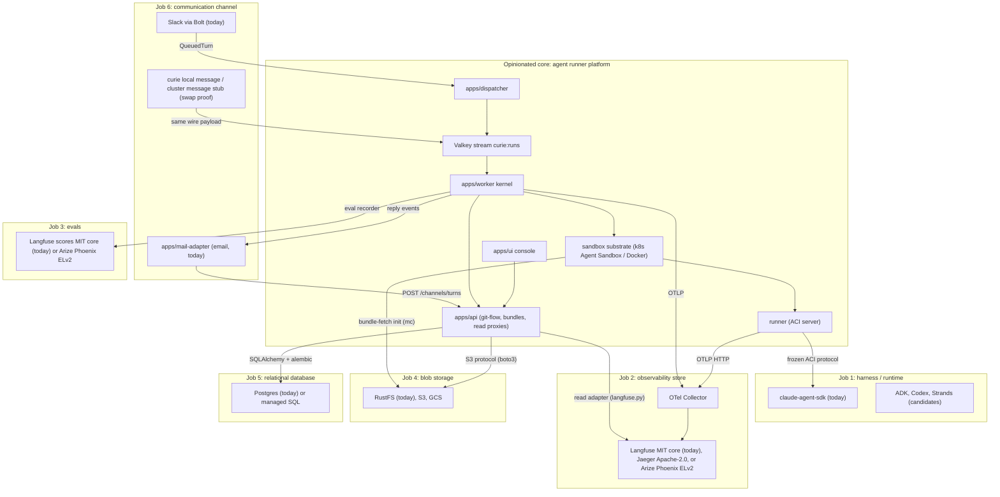

# Architecture Vision: Swappable Jobs Around an Opinionated Core

Curie is a set of jobs with swappable components tied together by one
opinionated core: the agent runner platform. The core (dispatcher, queue,
worker kernel, sandbox substrate, runner behind the frozen ACI protocol, the
API's git-flow engine, and the UI) is where the opinions live and where the
black-line interfaces are strongest. Around it sit six jobs a production agent
platform must do, each filled today by one curated default component, each
replaceable behind a port without rewriting the system.

The value framing matters as much as the wiring: the product is not a bag of
integrations. It tells a developer which pieces they actually need to run
agents in production (observability, evals, blob storage, a relational store,
a harness, a channel), ships a working default for each, and keeps the seams
clean enough that any one default can be swapped per job later. Hexagonal in
spirit, with discipline: one implementation per port today, and each port is
defined by where the code already draws the line, not by a speculative
interface layer. This doc grounds each job in the code on main: where the
boundary physically lives, the current adapter, the swap cost, and where the
seam honestly is not clean yet.

## The opinionated core

The core is everything a swap must not touch: `apps/dispatcher` normalizes
ingress into a queue event, `apps/worker` is the concurrency kernel (one live
session per thread, steer vs interrupt, no retry after side effects), the
sandbox substrate (`apps/worker/src/curie_worker/sandbox/`) claims isolated
runtimes on Kubernetes or Docker, `runner/` serves the ACI protocol inside the
sandbox, `apps/api` owns agents/versions/deployments and the git-flow deploy
engine, and `apps/ui` and `cli/` are the operator surfaces. The core's own
internal seams are already contracts: `packages/aci-protocol` and
`packages/plugin-format` are frozen, tri-language (Pydantic source of truth,
committed JSON Schema, generated TypeScript and Rust), and guarded by a
schema-compat CI test.

## The six swappable jobs

### 1. Harness / runtime (Claude Code today)

**Port:** the frozen ACI session protocol in `packages/aci-protocol`:
`SessionConfig` and its `CURIE_*` env mapping
(`packages/aci-protocol/src/aci_protocol/session.py`) plus the NDJSON event
union `text_delta | tool_note | final | error | side_effect_flag` and the
inbound `event | interrupt` frames
(`packages/aci-protocol/src/aci_protocol/events.py`). The worker, CLI, and UI
all compile against the generated artifacts; none of them import the SDK.

**Current adapter:** the runner. Inside the boundary it is deliberately
claude-agent-sdk-coupled: `runner/src/curie_runner/adapter.py` defines a
`ModelSession` protocol and implements it with `ClaudeSDKClient` in
streaming-input mode (native steer and interrupt), and `translate.py` maps SDK
messages to ACI events. Above the session sits the declared-package layer from
ADR-0060: a `HarnessContribution` manifest (name, image, install, auth,
read-only tool set, spawn env) registered through the `curie.harness`
entry-point group (`runner/src/curie_runner/harness/`), selected at boot via
`CURIE_HARNESS` and defaulting to the built-in Claude contribution. Exactly
one contribution exists today, so the registry is a guarded indirection around
the same adapter; conformance checks for third-party contributions are pending
(ADR-0062).

**Swap (candidates: ADK, Codex, Strands, other Claude Agent SDK variants):**
implement a new ACI server (an HTTP process that accepts `/v1/event`,
`/v1/steer`, `/v1/interrupt`, streams the NDJSON union, and honors the
`SessionConfig` env contract), package it as a runner image. The platform
does not change. The runner's conformance suite
(`runner/src/curie_runner/conformance.py`, driven by a scripted
`ModelSession`) is the reusable acceptance test for any new implementation.

**Leakage, stated honestly:** the harness port is entangled with the plugin
format. `packages/plugin-format` is the Claude Code plugin shape verbatim (a
deliberate distribution wedge), so a non-Claude harness must interpret Claude
Code plugin bundles or translate them into its own configuration; "implement
the ACI server" understates that work. Resume, by contrast, is harness-agnostic:
the boot path passes `resume=None`, and `CURIE_HISTORY_REF` is a durable
state-store URL for the thread's transcript that the runner loads and replays as a
boot-time system-prompt preamble
(`runner/src/curie_runner/history.py::format_conversation_preamble`), not an
SDK-native resume identifier (ADR-0029). A second harness rehydrates the same way
by reusing that state-store contract.

### 2. Observability / OTel store (Langfuse today)

**Port:** OTLP into the collector on the write side; our API DTOs on the read
side. Services never speak Langfuse directly: the runner exports gen_ai spans
over OTLP-HTTP to the collector (`runner/src/curie_runner/otel.py`), and the
collector is the single component that authenticates and forwards to Langfuse
(`charts/curie/templates/otel-collector.yaml`, needed because Langfuse OTLP
ingest is HTTP-only). On the read side the UI consumes only our API's schemas
(`ObservationNode`, `MetricsSummary` in `apps/api/src/curie_api/schemas.py`).

**Current adapter:** `apps/api/src/curie_api/langfuse.py` (trace list, tree
reconstruction from `parentObservationId`, metrics queries) plus
`apps/api/src/curie_api/metrics.py`. Langfuse is MIT at its core, with its
`ee/` directories under a separate commercial enterprise license. Vendor glue
lives where an adapter's glue should: the model-pricing seed Job is a chart hook
(`charts/curie/templates/langfuse-model-pricing.yaml`), config owned by the
adapter, not code in the core.

**Swap (candidates: Jaeger, Arize Phoenix, any OTLP-compatible trace backend):**
repoint one collector exporter block and rewrite the read
adapter behind the same API DTOs. License is part of the swap cost here:
Jaeger is Apache-2.0 and ingests OTLP natively, while Arize Phoenix is under
the Elastic License 2.0, source-available rather than OSI open source, and its
terms forbid providing the software to third parties as a hosted or managed
service; that is fine for an operator self-hosting Curie for its own use and a
problem for anyone running Curie's observability tier on someone else's behalf. The
tree-building and metrics logic in
`langfuse.py` is Langfuse-API-shaped (client-side substring scan, the Metrics
API query object) and would be rewritten, not ported.

**Leakage:** the runner stamps a `langfuse.trace.name` span attribute
(`runner/src/curie_runner/otel.py`), a vendor attribute on the otherwise
neutral write path; a clean seam would use a neutral attribute the collector
maps. The UI also reaches the read adapter through vendor-named routes
(`/langfuse/traces` in `apps/ui/src/api/client.ts`), so the vendor name leaks
into the URL namespace even though the payloads are ours.

### 3. Evals (Langfuse datasets/scores today)

**Port:** our own eval plane defines the schema; Langfuse is storage behind
it. The write path is the `curie:evals` Valkey stream carrying an
`EvalJob`, the wire model shared between the API producer and the worker
consumer (`packages/aci-protocol`, issue #492), consumed by
`apps/worker/src/curie_worker/eval/stream.py`,
with results shaped by our models (`apps/worker/src/curie_worker/eval/models.py`). The UI-facing read path
is our API's matrix endpoint (`apps/api/src/curie_api/routers/evals.py`)
returning our `EvalMatrix` schema, and the PR gate is our `/evals/report`
endpoint turning a rollup into a GitHub commit status.

**Current adapter:** `apps/worker/src/curie_worker/eval/recorder.py` posts one Langfuse trace plus an
`eval_pass` score per case via the public ingestion API, tagged
`version:<v>` / `suite:<s>`; the matrix endpoint reads the grid back by those
tags through the same `LangfuseClient`. It is the same MIT-cored Langfuse
deployment job 2 uses, so no additional license applies.

**Swap (candidates: Arize Phoenix, other eval stores; scorer libraries such as
autoevals slot in above this port, changing how `passed` is computed, not
where results are stored):** reimplement the recorder and the matrix read
against the new store. Arize Phoenix is Elastic License 2.0, source-available
rather than OSI open source, with the same restriction on offering it to third
parties as a hosted service. The store side is only two call sites, the
recorder write and the matrix read, so any backend reachable from those two
works, including the MIT-cored Langfuse already deployed; the permissively
licensed names in this space, promptfoo (MIT) and DeepEval (Apache-2.0), are
scorer frameworks that sit above this port rather than stores. The tag convention (`version:`/`suite:`) is our
schema expressed in Langfuse's tag mechanism, so it translates, but it is
convention, not a frozen contract.

**Leakage:** the eval-case format is now converged and frozen
([issue #8](https://github.com/curie-eng/curie/issues/8), ADR-0019): the CLI
reads the bundle's evals/cases.json as a suite object `{name, cases:[{id, input, grader}]}`
(`cli/src/evals.rs`) and the platform's bundle loader validates the same shape
(`apps/worker/src/curie_worker/eval/stream.py`), both building to one committed schema
(`apps/worker/schema/eval-cases.schema.json`) kept honest by a drift gate.

### 4. Blob storage (RustFS today)

**Port:** the S3 protocol. Both writers and readers construct plain boto3 S3
clients with an `endpoint_url` and path-style addressing: the API's immutable
bundle store (`apps/api/src/curie_api/storage.py`) and the worker's
read-side mirror (`apps/worker/src/curie_worker/bundle_store.py`). On
Kubernetes the chart's bundle-fetch init container fetches with the AWS CLI
(`charts/curie/templates/agent-sandbox.yaml`), also pure S3 protocol.

**Current adapter:** RustFS (Apache-2.0), deployed by the chart
(`charts/curie/templates/rustfs.yaml`).

**Swap:** AWS S3, Cloudflare R2, or any S3-compatible store is config only
(endpoint, keys, region). GCS is a real decision: either rely on its
S3-interoperability mode (stays config-only) or introduce an actual storage
interface, which does not exist today.

**Leakage:** the port is a protocol, not a code interface, and it is
instantiated in three places (API, worker, chart init container) that must be
kept aligned by hand. Within the S3-compatible world that is fine; a non-S3
backend would touch all three.

### 5. Relational database (Postgres today)

**Port:** SQL through SQLAlchemy 2.0 plus alembic migrations
(`apps/api/src/curie_api/models.py`, `apps/api/alembic/versions/`; run
`alembic heads` for the current tip rather than a count pinned here). The core
schema centers on agents, agent_versions, and deployments.

**Current adapter:** the chart's Postgres
(`charts/curie/templates/postgres.yaml`), under the permissive PostgreSQL
License; locally, the compose stack.

**Swap:** any managed Postgres (RDS, Cloud SQL, Neon) is a connection-string
change, and that is the realistic swap. A different SQL engine is a small
refactor, not a rewrite.

**Leakage:** two Postgres-isms are in the models: the
`sqlalchemy.dialects.postgresql.UUID` column type
(`apps/api/src/curie_api/models.py`) and schema-qualified tables plus a
schema-scoped native enum (`apps/api/src/curie_api/db.py::SCHEMA`, the
`Environment` enum). Both have portable SQLAlchemy equivalents if a
non-Postgres target ever materializes.

### 6. Communication channel (Slack and email today)

**Port:** the ingress half of this seam is now clean; the egress half is where
it stays least clean. The ingress contract was promoted out of the dispatcher
into the channel-neutral `QueuedTurn`
(`packages/aci-protocol/src/aci_protocol/turn.py::QueuedTurn`, issue #7): a
generic `event_id` idempotency key, a `conversation_id` conversation key, and a
`ReplyHandle` (`packages/aci-protocol/src/aci_protocol/turn.py::ReplyHandle`)
carrying the channel and placeholder, so the Slack-shaped field names are gone
from the core contract. The egress contract is the worker's `ReplySink` Protocol
(`apps/worker/src/curie_worker/reply_sink.py::ReplySink`), four neutral events
over a `TargetRoute`, with the vendor render below it in `SlackReplyAdapter`
(`apps/worker/src/curie_worker/slack_sink.py::SlackReplyAdapter`) and `to_mrkdwn`
(`apps/worker/src/curie_worker/mrkdwn.py::to_mrkdwn`). What keeps this seam at C
is that the kernel still assumes the edit-a-placeholder reply shape, so a channel
with no editable message emulates it.

**Current adapters:** two. Slack is `apps/dispatcher` (Bolt, Socket Mode) on
ingress and `SlackReplyAdapter` on egress. Email (#1515) is `apps/mail-adapter`,
one process outside the core that speaks only the HTTP wire: it POSTs each polled
message to `POST /channels/turns` under a scoped `chn` token and serves the four
reply events on its own endpoint behind `X-Curie-Adapter-Secret`, holding no
platform key, queue credential or database access. A third channel follows
[Building a channel adapter](guides/building-a-channel-adapter.md) and needs no
patch to this repo.

**Evidence the channel is already semi-swappable:** `curie local message` and
`curie cluster message` (`cli/src/chat.rs`, `cli/src/message.rs`) drive the entire
deployed system with zero Slack contact by minting the exact
`QueuedTurn` wire payload (`cli/src/queue.rs`) and standing in as the
Slack Web API. The Slack service swaps; the ingress payload is already
channel-neutral, and the remaining Slack coupling is the egress reply shape.

**What a channel-neutral port looks like:** both halves match that target now.
`QueuedTurn` carries `{event_id, conversation_id, author, text,
reply_handle, received_at}` ([issue #7](https://github.com/curie-eng/curie/issues/7),
landed), `ReplySink` carries post/update semantics per adapter, and the deployment
binding is a neutral `{kind, address}` pair
(`apps/worker/src/curie_worker/binding.py::BindingResolver.resolve`, #1459,
ADR-0096) rather than a Slack column. Reply routing landed per turn
([issue #19](https://github.com/curie-eng/curie/issues/19)): a turn's
`ReplyHandle.endpoint` (`packages/aci-protocol/src/aci_protocol/turn.py::ReplyHandle`)
is the reply target, so a real Slack workspace and a no-Slack CLI stub can coexist on
one deployment; the worker-global base URL (`worker.slackApiBaseUrl`) is now only the
fallback used when a turn sets no endpoint.

ADR-0020 fixes the target shape for this seam: a rendering-free port (required
core plus queryable capabilities plus semantic interaction intents) rendered
per-adapter, so Slack stays rich without forcing email/Teams/GitHub down to the
lowest common denominator. The channel-neutral rename above is its first
increment; the interaction-primitive half is driven now by the approval interface
(ADR-0010), not by waiting for a second channel.

## Component diagram

## Swap readiness

| Job | Port contract | Current adapter | Grade | Cheapest next step |
|---|---|---|---|---|
| Harness / runtime | Frozen ACI protocol (`packages/aci-protocol`), tri-language, CI-guarded | claude-agent-sdk runner | A-: strongest seam in the system; docked for the plugin-format entanglement and SDK-shaped resume | Write the "implement an ACI server" guide from the conformance suite so the port is documented, not just enforced |
| Observability | OTLP to collector (write), API DTOs (read) | Langfuse behind `langfuse.py` | B+: write side clean but for three vendor span attributes (`langfuse.trace.name`, `langfuse.session.id`, `langfuse.user.id`); read side spans several API modules plus routers | Map the three `langfuse.*` attributes to neutral names in the collector; rename the `/langfuse/*` API routes |
| Evals | Our stream schema + `EvalMatrix` DTO; store behind recorder | Langfuse traces + `eval_pass` scores | B: schema is ours; the case format converged into one frozen, drift-gated schema (#8, ADR-0019), leaving the `version:`/`suite:` tag convention as the unfrozen part | Freeze the tag convention into the schema, or record it as a deliberate soft contract |
| Blob storage | S3 protocol (boto3 + AWS CLI, path-style, endpoint-configurable) | RustFS | B+: config-only within S3-compatible stores; the client is now built in one shared place (`packages/aci-protocol/src/aci_protocol/s3.py::build_s3_client`, #572), and the `ObjectStore` port (`apps/api/src/curie_api/storage.py::ObjectStore`) names the contract, but the second, non-S3 adapter is deferred by decision until a real demand lands (#282) | None needed until a non-S3 demand exists |
| Relational DB | SQLAlchemy 2.0 + alembic | Postgres | A-: managed-Postgres swap is a DSN change; two Postgres-isms in models | Leave as is; note the `postgresql.UUID` and schema-scoped enum as the two things a non-Postgres target would touch |
| Communication | `QueuedTurn` (channel-neutral, in `aci-protocol`) + the `ReplySink` four-event wire | Slack (Bolt + chat.update) and email (`apps/mail-adapter`, out of process over HTTP) | C: both ends are channel-neutral and a second implementation ships (#1515), but the kernel still assumes an edit-in-place reply, so a channel with no editable message emulates it | Give the port an explicit post-once mode, so a channel that sends one message per turn is not modelled as an edit |

## What we deliberately do not abstract yet

The second implementation teaches the interface. Communication is the one port
above with two (Slack and email, #1515); the rest have one, and we resist
writing adapter layers ahead of a real swap demand: a speculative
`StorageInterface` or `ChannelAdapter` would encode
guesses about the second implementation's needs and would be wrong in the
ways that matter. Concretely, we do not yet abstract:

- A blob-storage interface beyond the S3 protocol. GCS-native support waits
  for a user who needs it; until then the protocol is the port.
- A multi-channel adapter framework. Email shipped as a service outside the
  core against the documented HTTP wire, with no registry and no patch to this
  repo, so the restraint stands (#27). Nuance (ADR-0020): the approval interface (ADR-0010) is a
  real forcing function that exists today, so the port's *interaction-primitive*
  half (semantic `Confirm`/`Choice` rendered per-adapter) is worth defining now;
  the full pluggable registry still waits for a demand the documented wire and a
  self-owned adapter service cannot already serve.
- A generic eval-store interface. The recorder is one file; the second store
  defines what the interface must be.
- Cross-database portability. Managed Postgres is the swap that will actually
  happen; chasing MySQL compatibility now buys nothing.

The discipline that keeps this honest is convention plus review: the boundary
files above are known and small, cross-seam imports get flagged in review, and
the two contracts that must not drift are frozen in CI. When a real swap
demand arrives, the port gets promoted from convention to contract the way the
ACI protocol already was.
