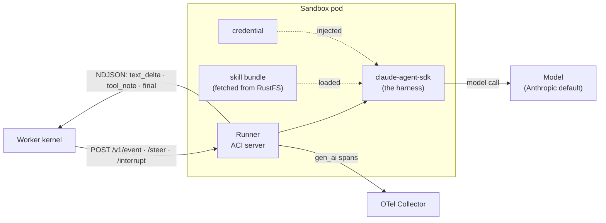

# The ACI: agent container interface

The **ACI** is the frozen contract between the worker and the agent running
inside a sandbox pod. The worker never talks to Claude Code or the model
directly; it talks to a **runner** over a small HTTP/NDJSON protocol. That seam
is what lets the platform stay the same while the thing inside the box (the
harness, the skill, the model) varies.

Think of the sandbox pod as a sealed box with one door. The worker knocks on the
door with an event; the box streams back deltas and a final answer. What happens
inside the box is the runner's business.

## The protocol (worker to runner)

Three routes, served by the runner at
[`runner/src/curie_runner/server.py`](../../runner/src/curie_runner/server.py):

| Route | Meaning |
|---|---|
| `POST /v1/event` | Open a turn. Body is an ACI `event` frame; the response streams NDJSON until a `final`. |
| `POST /v1/steer` | Inject a follow-up into the **live** turn (same frame type as `/v1/event`). Returns **409** if no turn is running, so the worker falls back to a fresh `/v1/event`. |
| `POST /v1/interrupt` | Hard-stop the live turn. Body is an ACI `interrupt` frame. |

The reply is a stream of NDJSON events defined in
[`packages/aci-protocol`](../../packages/aci-protocol):

- `text_delta` — streamed answer tokens
- `tool_note` — a tool call the agent made
- `side_effect_flag` — the turn did something with side effects
- `final` — the turn is done (carries the final text + status)
- `error`

An inbound `event` frame carries `{kind, type, text, user, ts}` plus optional,
nullable `session_id`, `history_ref`, and `adoption_credential` strings.
`session_id` and `history_ref` are conversation-scoped identity.
`adoption_credential` is the optional per-conversation runner credential on this
same authenticated event; omitted or null is the legacy cold path. Older
producers may omit any of these independently. A successful turn without
`adoption_applied: true` on the outbound stream is not adoption. Startup
configuration is a separate, environment-only `SessionConfig`; the per-event
fields do not replace it.

## Inside the box

The runner's job on each turn:

1. Accept the ACI `event` frame from the worker.
2. Drive the **harness** (today `claude-agent-sdk`, i.e. Claude Code) loaded with
   the **skill bundle** the init container fetched and the injected
   **credential**.
3. Stream `text_delta` / `tool_note` events back, then a `final`.
4. Emit `gen_ai`-style OTLP spans (`agent.run -> generation -> tool`) tagged with
   the session and sandbox id, so a trace ties back to the pod that served it.

## The credential path

The credential reaches the model without any app process brokering it. The
runner maps a prefixed credential onto the SDK's env var and **fails loud** on
anything it cannot use
([`runner/src/curie_runner/sdk_auth.py`](../../runner/src/curie_runner/sdk_auth.py)):

| Credential prefix | Maps to |
|---|---|
| `sk-ant-oat...` | `CLAUDE_CODE_OAUTH_TOKEN` (checked first) |
| `sk-ant-...` | `ANTHROPIC_API_KEY` |
| `sk-or-...` (OpenRouter) | routed through the base-URL-override seam to OpenRouter's Anthropic endpoint |
| `sk-...` (bare OpenAI style) | rejected — the Anthropic SDK cannot use it |
| anything else | treated as an OAuth token |

The **base-URL-override seam** (`resolve_base_url_override`) is how the runner
talks to any Anthropic-compatible endpoint without a real Anthropic credential:
it points `ANTHROPIC_BASE_URL` at the target and carries a non-empty placeholder
`ANTHROPIC_API_KEY` so the bundled CLI's auth gate passes. Both OpenRouter and
the opt-in **bundled local model** (Ollama / Qwen3 demo mode) ride this seam.

**Real model is the default.** The runner makes a real model call unless
`CURIE_FAKE_MODEL` is set (a test-only knob that swaps in a scripted fake). A
missing credential is fail-closed, not a silent downgrade to fake.

## What actually holds the contract

`packages/aci-protocol` is compiled against in Python, TypeScript, and Rust. The
Pydantic models are the source of truth; the JSON Schema and generated
TypeScript/Rust are derivatives. An unreviewed change in one language would
silently break the others, so a task that needs the protocol to change **stops
and escalates** rather than working around it (ADR-0005; see
[`ARCHITECTURE.md` §9](../../ARCHITECTURE.md)).

**"Frozen" does not mean the version never moves, and the schema-sync test is
not what protects you.** ADR-0036 exists to say so: the committed compat test
asserts `render_schema() == committed`, and because a model change is
regenerated and committed together it **always goes green**. It pins artifact
*sync*; it never pinned *compatibility*. Three things carry the contract
instead:

- **Semver, not a freeze.** `PROTOCOL_VERSION` is `0.4.5`
  ([`packages/aci-protocol/src/aci_protocol/version.py`](../../packages/aci-protocol/src/aci_protocol/version.py)),
  versioned independently of the Curie release. Under 0.x a consumer accepts
  the same `major.minor`; only a new optional field is compatible (patch), and
  every other change class bumps the minor.
- **Strict producers, tolerant consumers.** Constructing an event with an
  unknown field is an error, so producer mistakes are caught at the source; a
  decoder reading the wire **ignores fields it does not model**, which is what
  makes a minor bump mean something. Unknown *enum* values still reject rather
  than degrade: `SessionStatus` is control-bearing, and silently mapping a
  future `awaiting-approval`-like status onto `done` would finalize a turn that
  is actually pending a human decision.
- **The wire-lock gate**, the half that actually gates
  ([`packages/aci-protocol/src/aci_protocol/wire_lock.py`](../../packages/aci-protocol/src/aci_protocol/wire_lock.py)).
  A committed [`wire.lock`](../../packages/aci-protocol/schema/wire.lock) pins
  `{protocol_version, wire_sha256}`, fingerprinting the wire shape **with the
  version normalized out**. A wire change that ships without a bump fails the
  build naming the bump to make; a version-only bump passes. CI runs it against
  the base branch's lock.

ADR-0036 **amends** ADR-0005's frozen posture rather than superseding it: the
ACI is still a versioned contract that a task may not casually change; what
changed is how that is expressed and enforced.

Choosing the real Claude Code plugin shape for skills (rather than an invented
format) is the distribution wedge: a skill authored for Claude Code runs here
unchanged.

## Where this lives in the code

| Piece | Path |
|---|---|
| ACI protocol (frozen) | [`packages/aci-protocol/`](../../packages/aci-protocol) |
| Runner / ACI server | [`runner/src/curie_runner/server.py`](../../runner/src/curie_runner/server.py) |
| Runner interface contract | [`runner/src/curie_runner/INTERFACE.md`](../../runner/src/curie_runner/INTERFACE.md) |
| Credential mapping + base-URL override | [`runner/src/curie_runner/sdk_auth.py`](../../runner/src/curie_runner/sdk_auth.py) |
| Plugin / skill bundle shape | [`packages/plugin-format/`](../../packages/plugin-format) |
