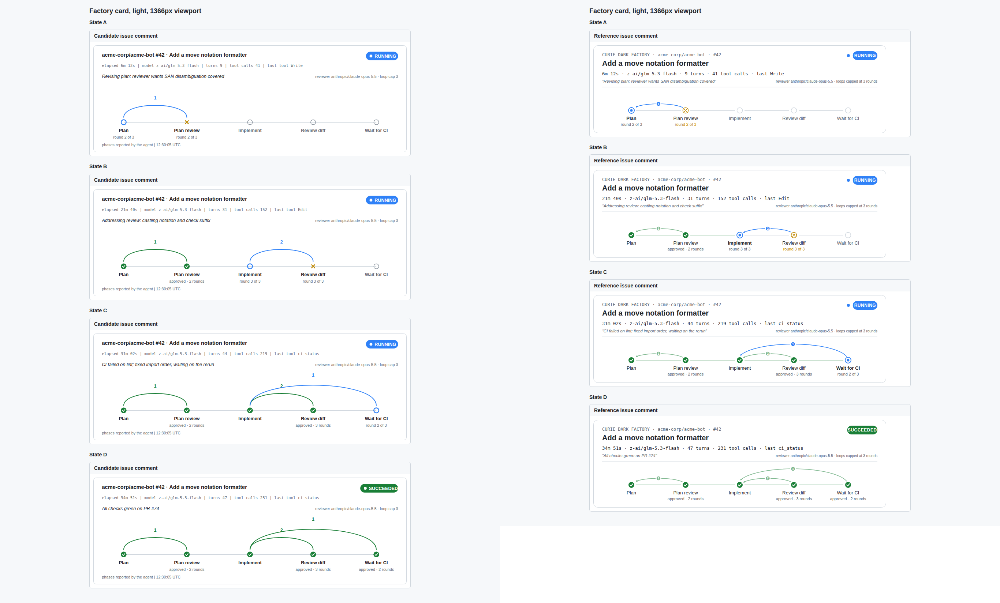
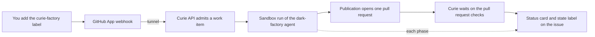

# Dark factory quickstart: a labelled issue becomes a pull request

This guide takes you from nothing to a pull request that Curie's dark factory
opened on a GitHub repository you just created. Everything runs on your laptop:
a local [kind](https://kind.sigs.k8s.io/) cluster and a
cloudflared quick tunnel so GitHub can reach the cluster.

You label an issue `curie-factory`. Curie reads it, plans, writes a test,
implements, reviews its own diff, opens one pull request, and waits on the
pull request's checks. A live status card on the issue shows each phase.



Budget about 30 minutes for the first pass, most of it waiting on Helm.

## How the loop works



The agent never pushes. It hands Curie a patch, and Curie publishes it from a
separate trusted job with your GitHub App's identity.

## What you need

| Tool | Used for |
|---|---|
| Docker | kind nodes |
| `kind` v0.24 or later, `kubectl`, `helm` | the local cluster. kind's network plugin enforces NetworkPolicy from v0.24, which the sandbox lockdown relies on. |
| `cloudflared` | a public URL for the GitHub webhook |
| `gh` | creating the repository, label and issue (the web UI works too) |
| `curie` v0.11.3 or later | install and deploy ([releases](https://github.com/curie-eng/curie/releases)) |
| An [OpenRouter](https://openrouter.ai/) API key | the factory model, `z-ai/glm-5.3-flash` by default |
| A GitHub account | your own GitHub App and the trial repository |

The guide uses three terminals: one for the commands, one for the tunnel and
one for a port-forward. The commands below use these variables; set them in
the first terminal now:

```bash
export KUBECONFIG="$HOME/.kube/curie-factory"   # a kubeconfig just for this guide
export OWNER=<your-github-login>
export REPO="$OWNER/curie-factory-quickstart"
export CURIE_CREDENTIALS=<openrouter-api-key>    # read by curie cluster up
```

## Step 1: Create the trial repository and the label

```bash
gh repo create "$REPO" --public --add-readme
gh label create curie-factory -R "$REPO" -c 5319E7 \
  -d "Hand this issue to the Curie dark factory"
```

`--add-readme` matters: the factory branches from the default branch, so the
repository needs one commit. It does not need CI. See
[What a repository with no CI sees](#what-a-repository-with-no-ci-sees).

**You should now see** the repository with one `README.md` commit, and a
`curie-factory` label under Issues > Labels.

## Step 2: Generate the webhook secret

There is no shared Curie App to install. Each self hosted Curie needs its own
App, because an App has exactly one webhook URL (yours) and one private key
(which only your cluster may hold). `curie cluster factory` prints a prefilled
registration link for it in Step 5, once a release exists to apply the intake
to. Until then, make the secret that signs the App's webhook deliveries:

```bash
openssl rand -hex 32 > ~/.curie-factory-webhook-secret
```

**You should now see** a 64 character line in that file.

## Step 3: Start a kind cluster

The factory agent runs on a runner layer each Curie release publishes, so the
cluster pulls it from GHCR like the platform images. No local registry is
needed.

```bash
kind create cluster --name curie-factory
```

kind's two CoreDNS replicas hit a conntrack race that stalls name lookups from
new pods for several seconds. In the proof run it made the runner crash at
start and a publication fail with `Could not resolve host: github.com`. One
replica avoids it:

```bash
kubectl -n kube-system scale deploy coredns --replicas=1
```

**You should now see** `kubectl get nodes` list `curie-factory-control-plane`,
and `kubectl -n kube-system get pods -l k8s-app=kube-dns` show one pod.

## Step 4: Open the tunnel

Start the tunnel before the App is registered so its URL can go into the App. Leave
it running in a second terminal:

```bash
cloudflared tunnel --no-autoupdate --url http://127.0.0.1:18000
```

Copy the `https://<words>.trycloudflare.com` URL it prints:

```bash
export TUNNEL_URL=https://<words>.trycloudflare.com
```

A quick tunnel gets a new URL every time it starts, and dies when the laptop
sleeps. `kubectl port-forward` can also drop a request now and then; a
delivery that failed that way can be redelivered from the App's delivery log. If it restarts, set the new URL as the App's Webhook URL and rerun the
`curie cluster factory` command in Step 5 with `--card-base-url` set to it.

## Step 5: Install Curie, then register the App and turn intake on

Install Curie with no factory settings first. Factory intake is turned on in a
second command, `curie cluster factory`, which needs a release to apply to.

```bash
curie cluster up --context kind-curie-factory --model z-ai/glm-5.3-flash
```

On kind the first install stops with `RuntimeClass "gvisor" not found` on
`Job/curie-preflight-gvisor`, after it has already switched gVisor off. Delete
the stale Job and run the same `cluster up` again
([#3618](https://github.com/curie-eng/curie/issues/3618)):

```bash
kubectl -n curie delete job curie-preflight-gvisor
```

**You should now see** `curie is up`, and `kubectl -n curie get pods` with
`curie-api` and `curie-worker` Running.

Check that the sandbox network lockdown is really enforced:

```bash
helm test curie -n curie --kube-context kind-curie-factory
kubectl -n curie logs job/curie-netpol-probe
```

The probe log must contain `enforcement=true`. If it says `enforcement=false`, your kind is older than
v0.24 or uses a network plugin without NetworkPolicy; stop here, because the
sandbox would have open network access.

Now expose the API to the tunnel. Leave this running in a third terminal. A
new terminal does not have the guide's `KUBECONFIG`, so name it:

```bash
kubectl --kubeconfig "$HOME/.kube/curie-factory" --context kind-curie-factory \
  -n curie port-forward svc/curie-api 18000:8000
```

**You should now see** `curl -s -o /dev/null -w '%{http_code}\n' "$TUNNEL_URL/health"`
print `200`.

### Register the GitHub App

Run `curie cluster factory` with no App flags (add `--org <org>` to register
the App on an organization instead of your account):

```bash
curie cluster factory --context kind-curie-factory
```

On a release with no App it prints a prefilled GitHub registration link and
four manual steps, and applies nothing. It never opens a browser. Open the
link and click **Create GitHub App**. The link fills in the name
(`curie-factory-<8 hex>`), a private App, and these repository permissions:
Metadata read, Contents write, Issues write, Pull requests write, Checks read,
Commit statuses write, and Actions read. Actions lets a CI repair round include
the failing job's log tail; without it the repair prompt says
`Job log unavailable.` With only one of Checks or Commit statuses a run ends
`ci_unverified`, which is why both are set.

The link registers the App with the webhook off and no event subscriptions.
Webhook intake is still required, so on the new App's settings page:

1. Note the **App ID** (a number).
2. Under **General > Webhook**, tick **Active**, set **Webhook URL** to
   `$TUNNEL_URL/github/webhook`, and set **Secret** to the contents of
   `~/.curie-factory-webhook-secret`.
3. Under **Permissions & events > Subscribe to events**, check **Issues**,
   **Issue comment**, **Pull request review**, and **Pull request review
   comment**. (They are the label that starts a run, a revision request that
   mentions the App, and review feedback.)
4. Under **Private keys**, click **Generate a private key** and save the
   downloaded `.pem`.
5. Under **Install App**, install it on your account with **Only select
   repositories** and your trial repository, or **All repositories**. This is
   a click in the web UI; the REST API refuses it for a user token.

```bash
export APP_ID=<app-id>
export APP_PEM=<path-to-downloaded.pem>
```

Rerun with the App's details, which turns intake on:

```bash
curie cluster factory --context kind-curie-factory \
  --app-id "$APP_ID" --private-key-file "$APP_PEM" \
  --webhook-secret-file ~/.curie-factory-webhook-secret \
  --card-base-url "$TUNNEL_URL"
```

The command reads everything from GitHub before it changes anything:

| What it does | Detail |
|---|---|
| Confirms the App | `GET /app` with a JWT signed by the key. A key or ID that does not match refuses the run. |
| Sets the mention | The App's slug, so a revision comment mentions `@<slug>`. |
| Sets the allowlist | The repositories the App is installed on. Pass `--repo owner/repo` (repeatable) to check specific repositories against them instead. |
| Sets the label | `curie-factory`, created in each allowlisted repository (pass `--label` to change it). |
| Stores the key | In Secret `curie-github-app`, key `privateKey`, written through `kubectl` stdin so it never enters argv or Helm values. A Secret that holds another App's key is refused. |
| Applies intake | A Helm upgrade that turns the factory intake on. |

The webhook secret and webhook URL are still required today. Once polling
intake ships (ADR 0187) a poll mode will not need them. `--card-base-url` is
the public origin GitHub fetches the live card image from; empty shows a text
checklist instead.

**You should now see** the command finish with intake applied, and
`kubectl -n curie get secret curie-github-app` list the Secret. In the
repository, **Issues > Labels** lists `curie-factory`. The App appears under
**Settings > Applications > Installed GitHub Apps** with access to the trial
repository.

## Step 6: Deploy the factory agent

The agent is the [`examples/dark-factory`](../../examples/dark-factory/README.md)
bundle, embedded in the CLI. Render it:

```bash
curie example dark-factory render --out dark-factory
```

**You should now see** `runner layer locked to the published
ghcr.io/curie-eng/curie-dark-factory-runner@sha256:...` and a lock file,
`connectors.lock.yaml`, in that directory. A release CLI records the runner
layer its release published, so there is nothing to build. A CLI built from
source has no published layer and says so; build the layer yourself with
`curie build --plugin-dir dark-factory --registry <ref>` and a registry your
nodes can pull from.

The bundle needs no GitHub token: the platform reads the issue for it with
your App.

```bash
curie cluster deploy --context kind-curie-factory --plugin-dir dark-factory \
  --agent dark-factory --env prod --repo "$REPO"
```

`cluster deploy` warns `push delivery is NOT armed`. That is about deploying
agents on `git push` and does not affect the factory.

Bind the agent to the repository and set its limits:

```bash
curie cluster surfaces dark-factory --add "github=$REPO"
curie cluster overrides dark-factory --execution-deadline 3600
curie cluster publication-policy dark-factory --policy auto
curie cluster budget dark-factory --limit 5
```

| Setting | Why this value |
|---|---|
| `--execution-deadline 3600` | The default 1800 seconds is tight once CI waits are counted. A small repository needs far less than the 10800 seconds the agent's skill plans for. |
| `--policy auto` | Publish without a human approval of each pull request. Leave it out to approve each one with `curie cluster approvals`. |
| `--limit 5` | A USD cap per day for the agent; a small ticket costs cents. |

The chart's default workspace (1 GiB) and runner resources fit a small new
repository. The 24 GiB workspace in the bundle README is sized for building
Curie itself.

**You should now see** `deployed dark-factory ... -> prod`, and the surfaces
line list `github:<owner>/curie-factory-quickstart`.

## Step 7: Label an issue

```bash
gh issue create -R "$REPO" -t 'Add a hello() function' -b \
'Add a Python module `hello.py` with a function `hello()` that returns the string `"hello"`, plus a unittest test in `test_hello.py` that checks it.

Acceptance criteria:
1. `hello.hello()` returns `"hello"`.
2. `python -m unittest` passes.'

gh issue edit 1 -R "$REPO" --add-label curie-factory
```

The person who adds the label must have write or admin access to the
repository. Anyone else's label is ignored.

**You should now see**, within a few seconds:

1. In the App's settings, **Advanced > Recent Deliveries**: an `issues`
   delivery with action `labeled` and response `200`.
2. On the issue: a `curie-factory:queued` label, then `curie-factory:running`,
   and one status comment whose card updates at each phase.
3. In the terminal:

   ```bash
   curie cluster work-items --context kind-curie-factory
   ```

   lists the issue as `waiting` (for sandbox capacity), then `running`.

## Step 8: Read the result

The agent works through nine phases: read the issue, pin the criteria, plan,
plan review, a failing test, implement, diff review, publish, and wait for CI.
When it publishes, the issue's status comment links the pull request and the
issue gets `curie-factory:pr-open`.

**You should now see** a pull request on the trial repository opened by your
App (`hello.py` and `test_hello.py`), and a final status comment like this
one from the proof run of this guide, on a repository with no CI:

```text
Completed: https://github.com/<owner>/curie-factory-quickstart/pull/2
Note: No CI checks appeared within 120 s.
Usage: implementer 465,785 tokens (cost unknown), total at least $0.02 (...)

Status: SUCCEEDED
```

In that run the pull request opened about four minutes after the label. A
finished run's work item reads `published`, and its request line in the
detail view reads `completed`.

```bash
curie cluster work-items --context kind-curie-factory <work-item-id>
```

shows the work item with its pull request and live CI state.

## Watch, revise, cancel, retry

| You want to | Do this |
|---|---|
| Watch a run | The status card on the issue, the `curie-factory:*` label, or `curie cluster work-items` |
| Ask for a revision | Comment on the issue and mention the App, for example `@<app-slug> also add a docstring`. A comment without the mention, an edit, or a comment from someone without write access does nothing. |
| Cancel | Remove the `curie-factory` label or close the issue. A pull request already opened stays open. |
| Retry | Remove the label and add it again. The new run gets its own status comment, and the old one says it was replaced. |

The state labels Curie manages, one at a time:

| Label | Meaning |
|---|---|
| `curie-factory:queued` | Admitted, waiting for a sandbox |
| `curie-factory:running` | Running or stopping |
| `curie-factory:pr-open` | Finished with a pull request |
| `curie-factory:needs-human` | Failed or expired; the status comment says why |

A cancelled run removes all four. Curie never changes your `curie-factory`
label.

## What a repository with no CI sees

1. **Checks.** After publishing, Curie waits on the pull request's checks. With
   no checks at all within 120 seconds of the push, and no required check
   configured for the repository, the run completes, and the final status
   comment says `Note: No CI checks appeared within 120 s.`
   A Python change in your repository is judged on your repository's own checks.
   Only a repository listed in `api.githubFactoryPythonCi` has a required check,
   and none is listed by default.
2. **In-sandbox verification.** Before the model starts, the runner runs the
   checks a repository declares in `.curie/verification.json`. With no <!-- doclint:ignore-line -->
   declaration it runs nothing and records `not_declared`, and the agent runs
   the repository's own tests itself where it can. See
   [Repository toolchain in the managed sandbox](repository-toolchain-in-the-managed-sandbox.md)
   to declare checks.
3. **Background builds.** The run ends when the agent's turn ends. A command
   the agent leaves running in the background does not keep the run alive.

## Troubleshooting

| What you see | Cause | Fix |
|---|---|---|
| Delivery log shows `401` | The webhook secret in the App differs from the file passed as `--webhook-secret-file` | Set the same secret in both, then redeliver |
| Delivery log shows `404` or `502` | The App webhook URL is wrong, or the tunnel or port-forward is down or dropped that request. GitHub never retries a failed delivery. | Check `curl $TUNNEL_URL/health`; restart the tunnel or port-forward and update the App URL if needed; then open the failed delivery and click **Redeliver** |
| Delivery is `200` but no work item appears | The labelling user lacks write access, the App is not installed on the repository (so it is not on the allowlist), the label name differs, or no agent has the `github=<owner/repo>` surface | Fix the setting and relabel |
| `403` when installing the App on a repository through the API | GitHub refuses that call for a user token | Install it in the web UI (Step 5) |
| `curie cluster factory` refuses with `not installed on any repository` | The App has no installation yet | Install it in the web UI (Step 5) and rerun |
| `curie cluster factory` refuses a key or Secret | The key does not authenticate as `--app-id`, or Secret `curie-github-app` holds another App's key | Pass the matching ID and key, or delete the Secret if it is stale |
| `curie-api` crash loops after `cluster factory` | Intake is on but a required value is missing | `kubectl -n curie logs deploy/curie-api` names it; set it and rerun `curie cluster factory` |
| `cluster up` fails on `Job/curie-preflight-gvisor` | A stale preflight Job on kind ([#3618](https://github.com/curie-eng/curie/issues/3618)) | `kubectl -n curie delete job curie-preflight-gvisor`, then rerun |
| `render` says no runner layer is published | The CLI is a source build, or its version has no published layer | Install a released `curie`, or build the layer with `curie build --plugin-dir dark-factory --registry <ref>` |
| Work item stays `waiting for sandbox capacity` | Another run holds the sandbox, or the runner pod cannot start | `kubectl -n curie get pods`; the run starts when capacity frees |
| Status comment ends with `Could not complete:` | The run stopped; the comment's `Cause:` and `Details:` lines say why | Fix the cause, then relabel |
| Run ends `ci_unverified` | The App cannot read Checks or Commit statuses | Grant both, accept the new permissions on the installation, relabel |
| `Could not complete: the pull request could not be opened.` with `Cause: publication_failed` | The publication Job could not push; `kubectl -n curie logs deploy/curie-worker` shows the git error. On kind, `Could not resolve host: github.com` is the CoreDNS race | Scale CoreDNS to one replica (Step 3), then label a new issue |
| A `curie-thread-*` pod restarts with `verification preflight report was not accepted` or `configured structured history could not be loaded` | Its first start lost a DNS lookup (the CoreDNS race), and later restarts are refused | Scale CoreDNS to one replica (Step 3), remove the label, then label a new issue |
| A label delivery shows `200` but nothing happens for five minutes | The delivery went to another URL (someone else repointed the App), or was lost | Check the App's webhook URL. The reconciler admits a labelled issue whose delivery never arrived after about five minutes |
| Card shows as a text checklist | The card base URL is empty or stale | Rerun `curie cluster factory` with `--card-base-url` set to the current tunnel URL |

## Moving to a real cluster

The factory pieces stay the same. What changes:

1. The published runner layer covers linux/amd64 and linux/arm64. If you edit
   the bundle's `runner.Dockerfile`, rebuild the layer with `curie build
   --plugin-dir dark-factory --registry <ref>` into a registry your nodes can
   pull from; that replaces the published entry in `connectors.lock.yaml`.
2. The webhook URL is a stable ingress for the `curie-api` Service instead of a
   tunnel, and `--card-base-url` is that origin.
3. gVisor stays on where the cluster has the `gvisor` RuntimeClass.
4. A larger repository needs bigger workspace and runner limits, a longer
   execution deadline, and package registry egress for dependency installs.
   The [dark-factory README](../../examples/dark-factory/README.md) has the
   sizing measured on Curie itself, and
   [operations](../operations.md#admitting-a-labelled-github-issue) has every
   intake and CI setting.

## Clean up

```bash
kind delete cluster --name curie-factory
```

Stop the tunnel and port-forward. Delete the App or its webhook URL when you
are done with it.
