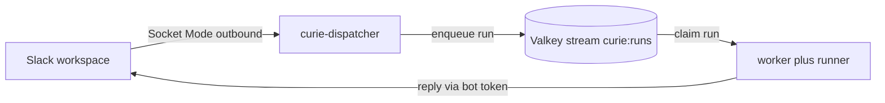

# Connect your own Slack workspace to the local stack

The `local` target (`curie local up`, the full platform via docker compose)
is Slack-free by default: `curie local message` sends a synthetic Slack
event and the worker posts replies at a local stub. This runbook wires a real
Slack app of your own into that same compose stack so you can exercise real
mentions, threads, and streamed replies without a Kubernetes cluster. Reach for
it when you need to see the actual Slack loop (Socket Mode ingestion, in-thread
placeholder, live edits); stay on the Slack-free default for everyday plugin
iteration. Prerequisite: a working `local` stack (see the
[README's local target](../README.md)) and the runner image built once.

The extra piece is an optional `curie-dispatcher` service in
`compose.release.yaml`, gated behind a `slack` compose profile so it stays off
until you opt in with real tokens.



## 1. Create the Slack app

Create the app from the manifest in this repo so the scopes and event
subscriptions are correct from the start.

1. Go to https://api.slack.com/apps, click **Create New App**, choose **From a
   manifest**, pick your workspace, and paste the contents of
   [`../apps/dispatcher/slack-app-manifest.yaml`](../apps/dispatcher/slack-app-manifest.yaml).
   It encodes:

   - Socket Mode on
   - the bot scopes (`app_mentions:read`, `chat:write`, `channels:read`,
     `channels:history`, `groups:history`, `im:history`, `im:read`,
     `assistant:write`, and `files:read`)
   - the `app_mention` and `message.im` event subscriptions
   - interactivity on (so button and block-action clicks arrive over Socket
     Mode)
2. Generate an **App-Level Token** with the `connections:write` scope (Basic
   Information -> App-Level Tokens). This `xapp-...` value is your
   `SLACK_APP_TOKEN`, used for the Socket Mode connection.
3. **Install to Workspace** (Install App), then copy the **Bot User OAuth
   Token**. This `xoxb-...` value is your `SLACK_BOT_TOKEN`, used by the Web API
   to post replies. If this app was installed before `channels:read` or
   `files:read` was added, reinstall it to the workspace so the existing
   bot-token grant is refreshed. A stale `channels:read` grant is what the boot
   preflight below refuses on; a stale `files:read` grant costs you attachments
   and a warning, not the boot.
4. `SLACK_SIGNING_SECRET` is optional and unused in Socket Mode (kept only for
   Bolt app construction); leave it empty.

5. **Turn on Agents & AI Apps** (your app -> **Agents & AI Apps** -> enable).
   This one has no manifest key, so creating the app from the manifest does not
   set it — it is a one-click manual step, and it is the only thing standing
   between you and the shimmer.

That last step is worth doing. The **shimmer** is the animated caption Slack
shows next to the app's name while a turn runs (`CURIE_SHIMMER`, **on by
default**, and the `assistant:write` scope it needs is already in the manifest).
Without it, the only sign the agent is working is the placeholder message — and
that message does not change until the model emits its first token, so a model
that reasons for thirty seconds before answering leaves the thread looking
frozen (issue #1182).

Skipping the toggle is safe, just quiet: `assistant.threads.setStatus` is
rejected, the call is swallowed best-effort (a debug log, never a failed turn),
and you get no caption. Set `CURIE_SHIMMER=false` to stop attempting it at all --
on the **worker**, which is the one service that raises and lowers the caption
(#1312); the dispatcher does not touch it.

## 2. Bind an agent to your channel

Connecting Slack is not enough for the bot to reply. The worker resolves an
inbound Slack event to an agent by matching the event's channel id against
the address stored in `agent_channels` on equality (see
[`../apps/worker/src/curie_worker/binding.py`](../apps/worker/src/curie_worker/binding.py)).
So you must both invite the bot to the channel and deploy an agent bound to
that channel's id.

1. Invite the bot to the channel (`/invite @your-bot` in Slack).
2. Get the channel **ID** (not the name): open channel details and read the id
   at the bottom of the About tab, or take it from the channel URL. It looks
   like `C0123ABCD`.
3. Deploy a plugin bound to that id against the local API (published on host
   port `28000`):

   ```bash
   curie local deploy --plugin-dir ./my-agent --slack-channel C0123ABCD \
     --api-url http://localhost:28000
   ```

The binding value MUST be the channel id (`C0123ABCD`), never the channel name
(`#triage`). A mention in a channel with no bound agent produces no reply. This
is the number-one "nothing happens" failure, so do this before you test.

## 3. Wire the tokens into compose and bring up the `slack` profile

Export the tokens into your shell and start the profile:

```bash
export SLACK_APP_TOKEN=xapp-...
export SLACK_BOT_TOKEN=xoxb-...
export SLACK_API_BASE_URL=          # empty: un-wire the worker's Slack stub -> real slack.com
curie local up --slack

# Raw Docker alternative (the dispatcher depends on valkey, a core service, so
# pair `slack` with a base profile):
docker compose --profile full --profile slack -f compose.release.yaml up -d
```

`curie local up --slack` appends the `slack` profile (the `curie-dispatcher`
service) onto the base `full` profile; `--minimal` pairs it with `core` instead.
The token exports above are still required either way -- the flag only adds the
profile, it does not set `SLACK_API_BASE_URL`.

What each export does:

- `SLACK_APP_TOKEN` and `SLACK_BOT_TOKEN` are read by the `curie-dispatcher`
  service (its `VALKEY_*` connection is already wired to the compose `valkey`
  service). A token-less dispatcher just backoff-reconnects forever, so the
  profile is meaningless without real tokens.
- Setting `SLACK_API_BASE_URL` to an EMPTY string un-wires the worker's Slack
  stub and points its outbound posts at real slack.com. The worker's default is
  `${SLACK_API_BASE_URL-http://localhost:8155/api/}` with a single `-`, so
  leaving the variable UNSET keeps the stub, and setting it empty overrides it.
- The worker reads `SLACK_BOT_TOKEN=${SLACK_BOT_TOKEN:-xoxb-dev}`, so the same
  `export SLACK_BOT_TOKEN` covers BOTH the dispatcher (inbound) and the worker
  (outbound real replies).

Socket Mode is outbound-only: the dispatcher dials Slack over an outbound
WebSocket, so your laptop needs no public ingress, port-forward, or tunnel.

Before opening that Socket Mode connection, the dispatcher performs bounded
preflights in this order: platform API `/health` reachability within
`CURIE_API_PREFLIGHT_TIMEOUT_SECONDS`, then authenticated `/agents` destination
discovery with `CURIE_API_KEY` and Slack metadata capability attempts together
within a fresh budget of the same size. `/health` is unauthenticated. If the
health budget expires, correct `CURIE_API_URL`; if discovery cannot finish,
check platform API availability and configuration, then retry.

If Slack cannot attempt every configured destination before its budget,
startup refuses safely: restore Slack availability or increase
`CURIE_API_PREFLIGHT_TIMEOUT_SECONDS`, then retry. These failures name only the
phase and recovery action, never configured Slack destinations or credentials.
After discovery, the dispatcher always makes one bounded public-channel
`conversations.list(types=public_channel, limit=1)` capability call, even with
zero configured destinations, then attempts `conversations.info` for every
configured destination. A Slack `missing_scope` or documented `invalid_types`
permission outcome on that public capability call maps unambiguously to the
recovery below without reading or logging its `needed` or `provided` sets.
Production creates a dedicated no-retry Slack WebClient for each metadata call,
with an integer timeout derived from the remaining phase budget and capped at
two seconds. The phase budget stops new attempts; a final already-started call
can extend it only by that bounded timeout.

The boot-fatal Slack metadata responses are `missing_scope` and
`invalid_types` from that fixed public-channel capability request. Both use the
same missing-public-permission recovery:
`Slack channel capability preflight failed: bot token is missing required scope channels:read. Add channels:read under OAuth & Permissions > Bot Token Scopes, then reinstall the app to the workspace.`

A second bounded call, `files.list` with `count=1`, proves `files:read` -- the
scope the worker needs to fetch the bytes of a file someone uploads to the bot.
It names no file, so a workspace holding no files still passes; an empty listing
is a full pass, because the question is whether the token may ask. A
`missing_scope` on that call is definitive but, unlike `channels:read`, it is
**not** boot-fatal. It logs its own one-scope recovery at WARNING and the stack
starts:
`Slack attachment capability unavailable: bot token is missing scope files:read, so inbound uploads cannot be fetched. Add files:read under OAuth & Permissions > Bot Token Scopes, then reinstall the app to the workspace. Messages are answered normally in the meantime.`
The asymmetry is deliberate. `channels:read` is what routing itself needs, so a
stack without it cannot answer anyone and should refuse to start. `files:read`
only fetches an upload, so refusing to boot for it would stop every message in
the workspace over a capability nobody had yesterday -- and would take down every
existing installation on upgrade until an admin reinstalled the app. The bot
keeps answering and attachments degrade instead, loudly: the summary line below
names which probe degraded, so this is not the silent per-upload denial the
probe exists to prevent. Any other outcome from that call (a rate limit, a
transport fault, an org-token refusal) is likewise non-terminal and only raises
the level of that summary line.
The preflight logs only a safe public capability state (`verified` or
`unverified`) and aggregate checked or unverified destination counts. Other
capability-call failures, plus private, stale, or transient per-destination
`conversations.info` outcomes, remain aggregate unverified warnings once every
destination has been attempted; no tokens or channel identifiers are printed.
An unverified warning can recur for a private channel, DM, stale destination,
or transient provider outcome; it is non-terminal and does not prove
private-channel or DM scope coverage. Correct the destination or access through
trusted configuration separately.

For the dispatcher-internals angle (its process, reconnect behavior, and app
creation details), see the runbook in
[`../apps/dispatcher/README.md`](../apps/dispatcher/README.md).

## 4. Verify

`@mention` the bot in the bound channel, or DM it. Expected: the dispatcher
acks and posts an in-thread placeholder reply, the worker claims the job from
the Valkey stream, and edits the placeholder in place as the real reply streams.

Sanity-check the queue depth inside the valkey container (the stream key is
`curie:runs`):

```bash
docker compose -f compose.release.yaml exec valkey valkey-cli -a valkeypass XLEN curie:runs
```

`valkeypass` is the `.env.example` default (`VALKEY_PASSWORD`); substitute your
own if you overrode it.

## Shared Socket Mode apps

Slack allows an app to maintain up to ten Socket Mode connections and may send
each payload to any connection, with no distribution pattern an application can
assume ([Slack's Socket Mode documentation](https://docs.slack.dev/apis/events-api/using-socket-mode/#using-multiple-connections)).
A local dispatcher and a cluster dispatcher can therefore connect with the same
app token, but they do not both receive each interaction.

Prefer a separate Slack app per long-lived Curie release. When two Curie
releases temporarily share one app, an approval interaction may first reach the
release whose API does not contain that approval. That release leaves the
approval and card unchanged and tells the approver to try again so Slack can
deliver a later interaction to the owner. Stop the extra dispatcher after the
overlap; the compose dispatcher remains off by default behind the Slack profile
to make accidental overlap less likely.

## Teardown and return to Slack-free

Stop everything, including the dispatcher:

```bash
curie local down
# or raw: docker compose -f compose.release.yaml down
```

Because the `SLACK_*` exports persist in the shell, a later plain
`curie local up` in the SAME shell keeps the worker pointed at real Slack
(empty `SLACK_API_BASE_URL`) with no dispatcher feeding it. To fully return to
the Slack-free stub, open a fresh shell or unset the variables:

```bash
unset SLACK_API_BASE_URL SLACK_APP_TOKEN SLACK_BOT_TOKEN
```

## Troubleshooting

- **Nothing happens on mention.** Almost always the channel-to-agent binding.
  Check that an agent is deployed with `--slack-channel` set to the channel
  **id** (not `#name`), and that the bot is actually invited to the channel. A
  channel with no bound agent produces no reply.
- **Dispatcher backoff-reconnect loop.** Bad or absent tokens. Confirm
  `SLACK_APP_TOKEN` (`xapp-...`, `connections:write`) and `SLACK_BOT_TOKEN`
  (`xoxb-...`) are exported in the shell that ran `docker compose`.
- **"conflict" or multiple-connection errors.** Two Socket Mode owners on one
  app token (for example a local dispatcher and a cluster dispatcher). Stop one
  before starting the other.
